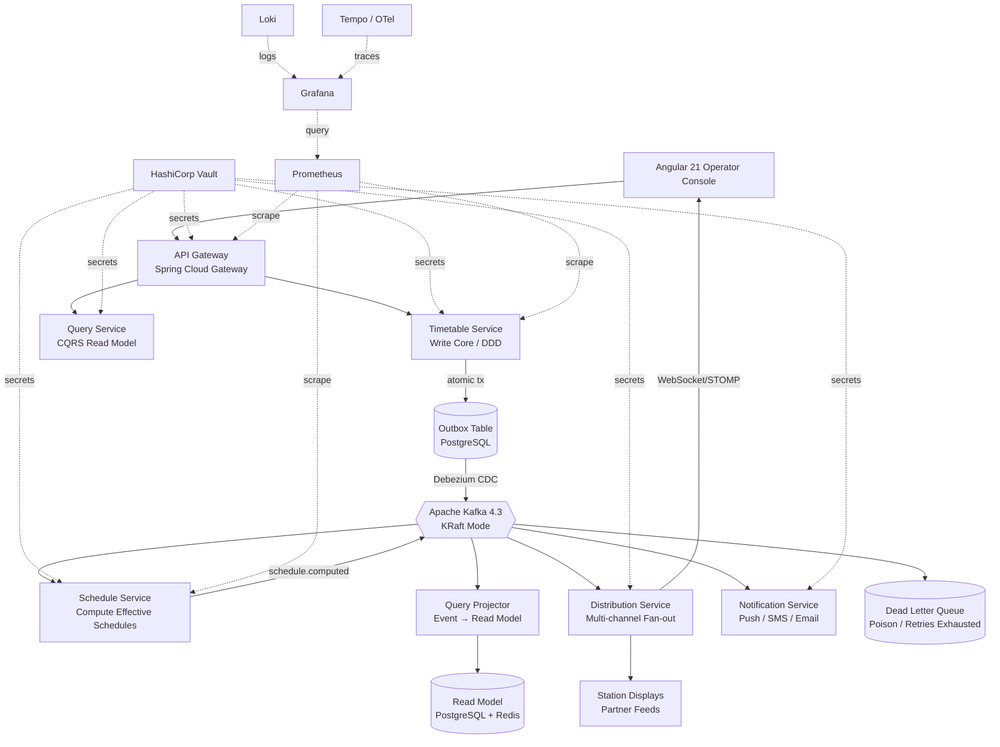

# Railway Timetable Distribution Platform

A production-grade, event-driven microservices platform for authoring, approving, and distributing railway timetables to passenger apps, station displays, and partner feeds in near-real-time.

## Architecture



## Non-Functional Targets

| Metric | Target |
|--------|--------|
| Read API availability | 99.9% |
| p99 read latency | < 300 ms |
| p99 write latency | < 800 ms |
| Timetable change visible (all channels) | ≤ 5 s p95 |
| Acknowledged-write loss | Zero |
| Consumer safety | Idempotent, replay-safe |
| Audit trail | Immutable, append-only |

## Key Architectural Patterns

- **Transactional Outbox** — state change and outbox row committed atomically; Debezium relays to Kafka. Eliminates dual-write inconsistency.
- **Event-Driven / CQRS** — separate write and read models; projector rebuilds read model from event replay.
- **Idempotent Consumers** — deduplicated on `eventId`; at-least-once delivery is safe.
- **Saga / Compensation** — distribution failures trigger compensating actions rather than leaving partial state.
- **Circuit Breaker + Bulkhead** — Resilience4j at the gateway prevents cascade failures.

## Phase Map

| Phase | Scope | Status |
|-------|-------|--------|
| 0 | Foundations (repo, common-lib, events, docker-compose) | ✅ |
| 1 | Timetable Service (write core, outbox, approval, audit) | ⬜ |
| 2 | Kafka backbone + Schedule Service | ⬜ |
| 3 | Query Service (CQRS read side + projector) | ⬜ |
| 4 | Distribution + Notification Services | ⬜ |
| 5 | API Gateway | ⬜ |
| 6 | Frontend (Angular 21 operator console) | ⬜ |
| 7 | CI/CD, IaC, Observability | ⬜ |
| 8 | Hardening & docs | ⬜ |

## One-Command Local Bring-Up

```bash
# Prerequisites: Docker Desktop ≥ 4.x, make, Java 21, Node 22
make up        # Start full infra stack (PG, Kafka, Redis, Vault, observability)
make dev       # Start all services in dev mode against the local stack
make test      # Run all unit + integration tests
make down      # Tear down everything
```

See [Makefile](Makefile) for all available targets.

## Module READMEs

| Module | Purpose |
|--------|---------|
| [shared/common-lib](shared/common-lib/README.md) | Error model, correlation-ID, logging, base config |
| [shared/events](shared/events/README.md) | Avro schemas and generated event POJOs |
| [services/timetable-service](services/timetable-service/README.md) | Write core: CRUD, approval, outbox |
| [services/schedule-service](services/schedule-service/README.md) | Compute effective schedules from timetable events |
| [services/query-service](services/query-service/README.md) | CQRS read model + projector |
| [services/distribution-service](services/distribution-service/README.md) | Fan-out to channels + WebSocket push |
| [services/notification-service](services/notification-service/README.md) | Idempotent push/SMS/email |
| [services/api-gateway](services/api-gateway/README.md) | Authn/z, routing, rate limiting, circuit breaker |
| [frontend/operator-console](frontend/operator-console/README.md) | Angular 21 authoring + passenger views |
| [infra/terraform](infra/terraform/README.md) | AWS infrastructure (VPC, EKS, RDS, MSK, Vault) |
| [infra/helm](infra/helm/README.md) | Kubernetes Helm charts per service |
| [infra/vault](infra/vault/README.md) | Vault policies and secret-path layout |
| [infra/observability](infra/observability/README.md) | Prometheus rules, Grafana dashboards, alerts |

## Documentation

- [Architecture deep-dive](docs/architecture.md)
- [Resolved versions](docs/VERSIONS.md)
- [Configuration reference](docs/CONFIGURATION.md)
- [ADRs](docs/adr/)

## Tech Stack

| Layer | Technology | Version |
|-------|-----------|---------|
| Backend runtime | Java LTS | 21 |
| Backend framework | Spring Boot | 4.0.6 |
| Cloud / resilience | Spring Cloud | 2025.x GA |
| Messaging | Apache Kafka (KRaft) | 4.3.0 |
| Schema registry | Confluent Schema Registry | 7.9.x |
| Database | PostgreSQL | 16.x |
| CDC / Outbox relay | Debezium | 3.1.x |
| Cache | Redis | 7.x |
| Migrations | Flyway | 11.x |
| Frontend | Angular | 21 |
| Frontend state | NgRx Signals Store | 19.x |
| Secrets | HashiCorp Vault | 1.19.x |
| Containers | Docker + Kubernetes (EKS) | current |
| Observability | Prometheus, Grafana, Loki, Tempo | current |

---

> **Security:** No secrets are stored in this repository. All secrets are sourced from HashiCorp Vault. See [infra/vault/README.md](infra/vault/README.md).
