# Railway Timetable Distribution Platform — Technical Architecture Flows

> Diagrams use **PlantUML** syntax. Render with:
> - IntelliJ / VS Code **PlantUML extension**
> - Online: https://www.plantuml.com/plantuml/
> - CLI: `plantuml -tsvg docs/ARCHITECTURE-FLOWS.md`
> - Confluence PlantUML macro
>
> Every diagram maps directly to code in this repository. File paths are relative to the repo root.

---

## Table of Contents

1. [System Overview](#1-system-overview)
2. [Layer 0 — Shared Foundation](#2-layer-0--shared-foundation)
3. [Layer 1 — Edge: API Gateway](#3-layer-1--edge-api-gateway)
4. [Layer 2 — Write Side: Timetable Service](#4-layer-2--write-side-timetable-service)
5. [Layer 3 — CDC Transport: Debezium → Kafka](#5-layer-3--cdc-transport-debezium--kafka)
6. [Layer 4 — Compute Side: Schedule Service](#6-layer-4--compute-side-schedule-service)
7. [Layer 5 — Read Side: Query Service](#7-layer-5--read-side-query-service)
8. [Layer 6 — Distribution / Fan-Out: Distribution Service](#8-layer-6--distribution--fan-out-distribution-service)
9. [Layer 7 — Notifications: Notification Service](#9-layer-7--notifications-notification-service)
10. [Layer 8 — Observability Stack](#10-layer-8--observability-stack)
11. [Layer 9 — Infrastructure: Helm + Terraform + CI/CD](#11-layer-9--infrastructure-helm--terraform--cicd)
12. [End-to-End Flow: Timetable Change to Passenger Notification](#12-end-to-end-flow-timetable-change-to-passenger-notification)
13. [End-to-End Flow: Emergency Activation](#13-end-to-end-flow-emergency-activation)
14. [Appendix: Idempotency Pattern](#14-appendix-idempotency-pattern-all-consumers)

---

## 1. System Overview

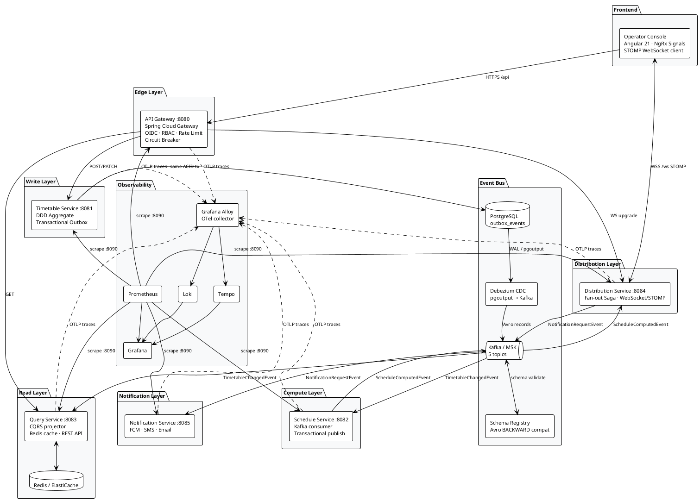
```plantuml
@startuml system-overview
!theme plain
skinparam componentStyle rectangle
skinparam defaultFontSize 11
skinparam ArrowFontSize 10
skinparam packageBackgroundColor #F8F9FA
skinparam componentBackgroundColor #FFFFFF

package "Frontend" {
  [Operator Console\nAngular 21 · NgRx Signals\nSTOMP WebSocket client] as OC
}

package "Edge Layer" {
  [API Gateway :8080\nSpring Cloud Gateway\nOIDC · RBAC · Rate Limit\nCircuit Breaker] as GW
}

package "Write Layer" {
  [Timetable Service :8081\nDDD Aggregate\nTransactional Outbox] as TS
}

package "Event Bus" {
  database "PostgreSQL\noutbox_events" as DB
  [Debezium CDC\npgoutput → Kafka] as DEZ
  queue "Kafka / MSK\n5 topics" as KF
  [Schema Registry\nAvro BACKWARD compat] as SR
}

package "Compute Layer" {
  [Schedule Service :8082\nKafka consumer\nTransactional publish] as SS
}

package "Read Layer" {
  [Query Service :8083\nCQRS projector\nRedis cache · REST API] as QS
  database "Redis / ElastiCache" as REDIS
}

package "Distribution Layer" {
  [Distribution Service :8084\nFan-out Saga · WebSocket/STOMP] as DS
}

package "Notification Layer" {
  [Notification Service :8085\nFCM · SMS · Email] as NS
}

package "Observability" {
  [Prometheus] as PROM
  [Grafana] as GRAF
  [Loki] as LOKI
  [Tempo] as TEMPO
  [Grafana Alloy\nOTel collector] as ALLOY
}

OC --> GW   : HTTPS /api
OC <--> DS  : WSS /ws STOMP
GW --> QS   : GET
GW --> TS   : POST/PATCH
GW --> DS   : WS upgrade

TS --> DB   : same ACID tx
DB --> DEZ  : WAL / pgoutput
DEZ --> KF  : Avro records
KF <--> SR  : schema validate

KF --> SS   : TimetableChangedEvent
KF --> QS   : TimetableChangedEvent
SS --> KF   : ScheduleComputedEvent
KF --> DS   : ScheduleComputedEvent
DS --> KF   : NotificationRequestEvent
KF --> NS   : NotificationRequestEvent
QS <--> REDIS

TS ..> ALLOY : OTLP traces
SS ..> ALLOY : OTLP traces
QS ..> ALLOY : OTLP traces
DS ..> ALLOY : OTLP traces
NS ..> ALLOY : OTLP traces
GW ..> ALLOY : OTLP traces

ALLOY --> TEMPO
ALLOY --> LOKI
PROM ---> TS   : scrape :8090
PROM ---> SS   : scrape :8090
PROM ---> QS   : scrape :8090
PROM ---> DS   : scrape :8090
PROM ---> NS   : scrape :8090
PROM ---> GW   : scrape :8090
PROM --> GRAF
TEMPO --> GRAF
LOKI --> GRAF

@enduml
```

---

## 2. Layer 0 — Shared Foundation

### 2.1 Shared Events (`shared/events/`)

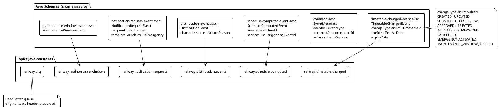
```plantuml
@startuml shared-events
!theme plain
skinparam componentStyle rectangle
skinparam defaultFontSize 11

package "Avro Schemas  (src/main/avro/)" {
  [common.avsc\nEventMetadata\neventId · eventType\noccurredAt · correlationId\nactor · schemaVersion] as CM

  [timetable-changed-event.avsc\nTimetableChangedEvent\nchangeType enum · timetableId\nlineId · effectiveDate\nexpiryDate] as TC

  [schedule-computed-event.avsc\nScheduleComputedEvent\ntimetableId · lineId\nservices list · triggeringEventId] as SC

  [distribution-event.avsc\nDistributionEvent\nchannel · status · failureReason] as DE

  [notification-request-event.avsc\nNotificationRequestEvent\nrecipientIds · channels\ntemplate variables · isEmergency] as NR

  [maintenance-window-event.avsc\nMaintenanceWindowEvent] as MW
}

package "Topics.java constants" {
  [railway.timetable.changed] as T1
  [railway.schedule.computed] as T2
  [railway.distribution.events] as T3
  [railway.notification.requests] as T4
  [railway.maintenance.windows] as T5
  [railway.dlq] as T6
}

TC --> T1
SC --> T2
DE --> T3
NR --> T4
MW --> T5

note bottom of T6
  Dead letter queue.
  original-topic header preserved.
end note

note right of TC
  changeType enum values:
  CREATED · UPDATED
  SUBMITTED_FOR_REVIEW
  APPROVED · REJECTED
  ACTIVATED · SUPERSEDED
  CANCELLED
  EMERGENCY_ACTIVATED
  MAINTENANCE_WINDOW_APPLIED
end note

@enduml
```

### 2.2 Common Library (`shared/common-lib/`) — Correlation ID Flow

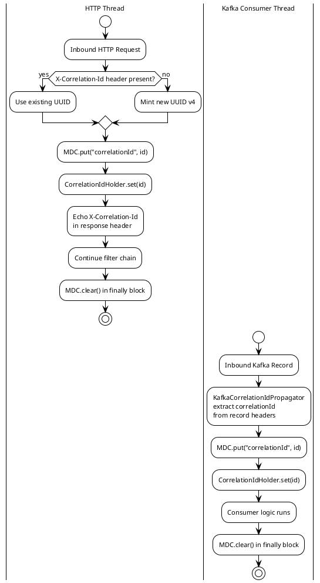
```plantuml
@startuml correlation-id-flow
!theme plain
skinparam defaultFontSize 11

|HTTP Thread|
start
:Inbound HTTP Request;
if (X-Correlation-Id header present?) then (yes)
  :Use existing UUID;
else (no)
  :Mint new UUID v4;
endif
:MDC.put("correlationId", id);
:CorrelationIdHolder.set(id);
:Echo X-Correlation-Id\nin response header;
:Continue filter chain;
:MDC.clear() in finally block;
stop

|Kafka Consumer Thread|
start
:Inbound Kafka Record;
:KafkaCorrelationIdPropagator\nextract correlationId\nfrom record headers;
:MDC.put("correlationId", id);
:CorrelationIdHolder.set(id);
:Consumer logic runs;
:MDC.clear() in finally block;
stop

@enduml
```

### 2.3 Global Exception Handler

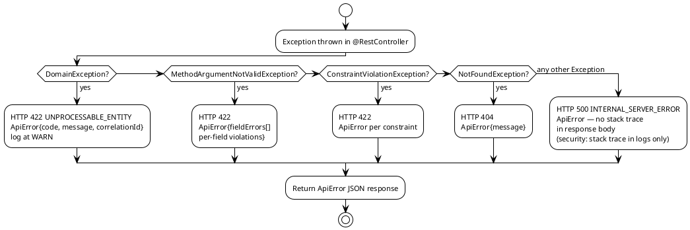
```plantuml
@startuml exception-handler
!theme plain
skinparam defaultFontSize 11

start
:Exception thrown in @RestController;
if (DomainException?) then (yes)
  :HTTP 422 UNPROCESSABLE_ENTITY\nApiError{code, message, correlationId}\nlog at WARN;
elseif (MethodArgumentNotValidException?) then (yes)
  :HTTP 422\nApiError{fieldErrors[]\nper-field violations};
elseif (ConstraintViolationException?) then (yes)
  :HTTP 422\nApiError per constraint;
elseif (NotFoundException?) then (yes)
  :HTTP 404\nApiError{message};
else (any other Exception)
  :HTTP 500 INTERNAL_SERVER_ERROR\nApiError — no stack trace\nin response body\n(security: stack trace in logs only);
endif
:Return ApiError JSON response;
stop

@enduml
```

---

## 3. Layer 1 — Edge: API Gateway

**Port:** 8080 (app) · 8090 (actuator)
**Key files:** `services/api-gateway/src/main/java/com/railway/platform/gateway/config/`

### 3.1 Request Processing Pipeline

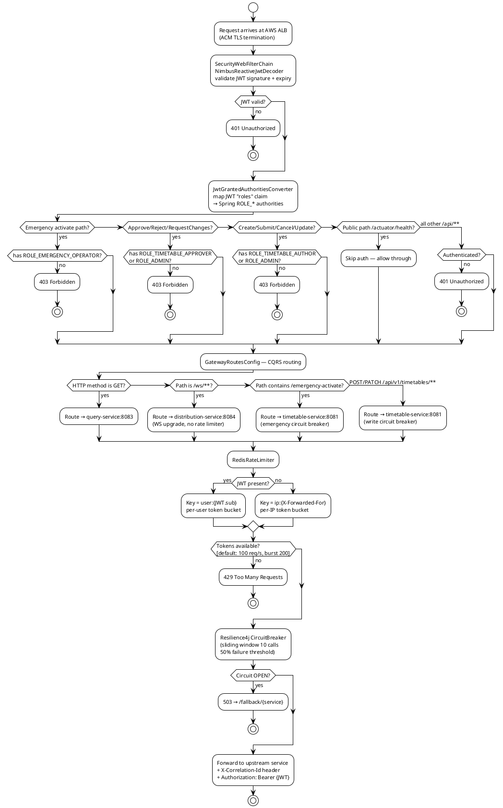
```plantuml
@startuml gateway-pipeline
!theme plain
skinparam defaultFontSize 11

start

:Request arrives at AWS ALB\n(ACM TLS termination);

:SecurityWebFilterChain\nNimbusReactiveJwtDecoder\nvalidate JWT signature + expiry;

if (JWT valid?) then (no)
  :401 Unauthorized;
  stop
endif

:JwtGrantedAuthoritiesConverter\nmap JWT "roles" claim\n→ Spring ROLE_* authorities;

if (Emergency activate path?) then (yes)
  if (has ROLE_EMERGENCY_OPERATOR?) then (no)
    :403 Forbidden;
    stop
  endif
elseif (Approve/Reject/RequestChanges?) then (yes)
  if (has ROLE_TIMETABLE_APPROVER\nor ROLE_ADMIN?) then (no)
    :403 Forbidden;
    stop
  endif
elseif (Create/Submit/Cancel/Update?) then (yes)
  if (has ROLE_TIMETABLE_AUTHOR\nor ROLE_ADMIN?) then (no)
    :403 Forbidden;
    stop
  endif
elseif (Public path /actuator/health?) then (yes)
  :Skip auth — allow through;
else (all other /api/**)
  if (Authenticated?) then (no)
    :401 Unauthorized;
    stop
  endif
endif

:GatewayRoutesConfig — CQRS routing;

if (HTTP method is GET?) then (yes)
  :Route → query-service:8083;
elseif (Path is /ws/**?) then (yes)
  :Route → distribution-service:8084\n(WS upgrade, no rate limiter);
elseif (Path contains /emergency-activate?) then (yes)
  :Route → timetable-service:8081\n(emergency circuit breaker);
else (POST/PATCH /api/v1/timetables/**)
  :Route → timetable-service:8081\n(write circuit breaker);
endif

:RedisRateLimiter;

if (JWT present?) then (yes)
  :Key = user:{JWT.sub}\nper-user token bucket;
else (no)
  :Key = ip:{X-Forwarded-For}\nper-IP token bucket;
endif

if (Tokens available?\n[default: 100 req/s, burst 200]) then (no)
  :429 Too Many Requests;
  stop
endif

:Resilience4j CircuitBreaker\n(sliding window 10 calls\n50% failure threshold);

if (Circuit OPEN?) then (yes)
  :503 → /fallback/{service};
  stop
endif

:Forward to upstream service\n+ X-Correlation-Id header\n+ Authorization: Bearer {JWT};
stop

@enduml
```

---

## 4. Layer 2 — Write Side: Timetable Service

**Port:** 8081 (app) · 8090 (actuator)
**Key files:** `services/timetable-service/src/main/java/com/railway/platform/timetable/`

### 4.1 Domain Model — Approval State Machine

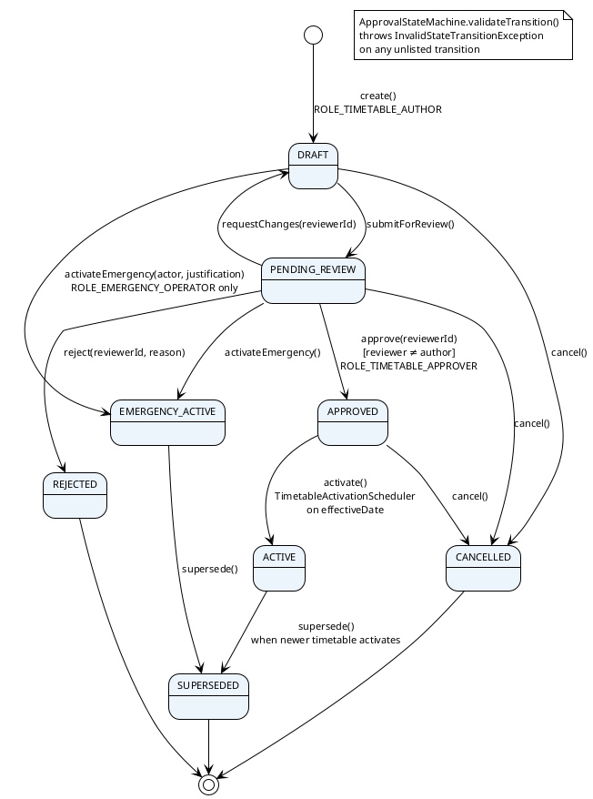
```plantuml
@startuml state-machine
!theme plain
skinparam defaultFontSize 11
skinparam stateFontSize 11
skinparam stateBackgroundColor #EBF5FB

[*] --> DRAFT : create()\nROLE_TIMETABLE_AUTHOR

DRAFT --> PENDING_REVIEW : submitForReview()
DRAFT --> CANCELLED     : cancel()

PENDING_REVIEW --> APPROVED       : approve(reviewerId)\n[reviewer ≠ author]\nROLE_TIMETABLE_APPROVER
PENDING_REVIEW --> REJECTED       : reject(reviewerId, reason)
PENDING_REVIEW --> DRAFT          : requestChanges(reviewerId)
PENDING_REVIEW --> CANCELLED      : cancel()

APPROVED --> ACTIVE    : activate()\nTimetableActivationScheduler\non effectiveDate
APPROVED --> CANCELLED : cancel()

ACTIVE --> SUPERSEDED : supersede()\nwhen newer timetable activates

DRAFT            --> EMERGENCY_ACTIVE : activateEmergency(actor, justification)\nROLE_EMERGENCY_OPERATOR only
PENDING_REVIEW   --> EMERGENCY_ACTIVE : activateEmergency()

EMERGENCY_ACTIVE --> SUPERSEDED : supersede()

REJECTED  --> [*]
SUPERSEDED --> [*]
CANCELLED --> [*]

note "ApprovalStateMachine.validateTransition()\nthrows InvalidStateTransitionException\non any unlisted transition" as N1

@enduml
```

### 4.2 Command Handler — Single ACID Transaction

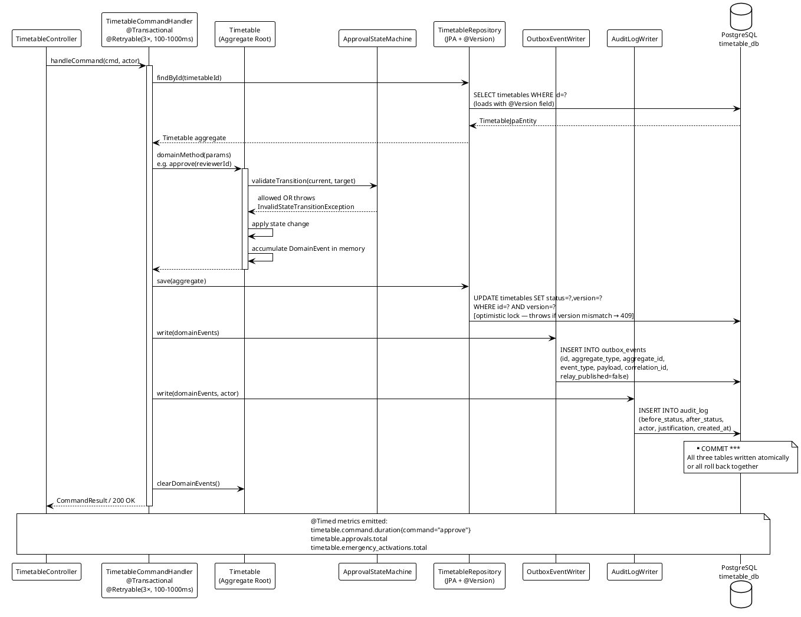
```plantuml
@startuml command-handler
!theme plain
skinparam defaultFontSize 11
skinparam sequenceMessageAlign left

participant "TimetableController" as CTL
participant "TimetableCommandHandler\n@Transactional\n@Retryable(3×, 100–1000ms)" as CH
participant "Timetable\n(Aggregate Root)" as AGG
participant "ApprovalStateMachine" as SM
participant "TimetableRepository\n(JPA + @Version)" as REPO
participant "OutboxEventWriter" as OEW
participant "AuditLogWriter" as ALW
database "PostgreSQL\ntimetable_db" as DB

CTL -> CH : handleCommand(cmd, actor)
activate CH

CH -> REPO : findById(timetableId)
REPO -> DB : SELECT timetables WHERE id=?\n(loads with @Version field)
DB --> REPO : TimetableJpaEntity
REPO --> CH : Timetable aggregate

CH -> AGG : domainMethod(params)\ne.g. approve(reviewerId)
activate AGG
AGG -> SM : validateTransition(current, target)
SM --> AGG : allowed OR throws\nInvalidStateTransitionException
AGG -> AGG : apply state change
AGG -> AGG : accumulate DomainEvent in memory
AGG --> CH
deactivate AGG

CH -> REPO : save(aggregate)
REPO -> DB : UPDATE timetables SET status=?,version=?\nWHERE id=? AND version=?\n[optimistic lock — throws if version mismatch → 409]

CH -> OEW : write(domainEvents)
OEW -> DB : INSERT INTO outbox_events\n(id, aggregate_type, aggregate_id,\nevent_type, payload, correlation_id,\nrelay_published=false)

CH -> ALW : write(domainEvents, actor)
ALW -> DB : INSERT INTO audit_log\n(before_status, after_status,\nactor, justification, created_at)

note over DB : *** COMMIT ***\nAll three tables written atomically\nor all roll back together

CH -> AGG : clearDomainEvents()

CH --> CTL : CommandResult / 200 OK
deactivate CH

note over CTL, DB
  @Timed metrics emitted:
  timetable.command.duration{command="approve"}
  timetable.approvals.total
  timetable.emergency_activations.total
end note

@enduml
```

### 4.3 Transactional Outbox + Fallback Relay

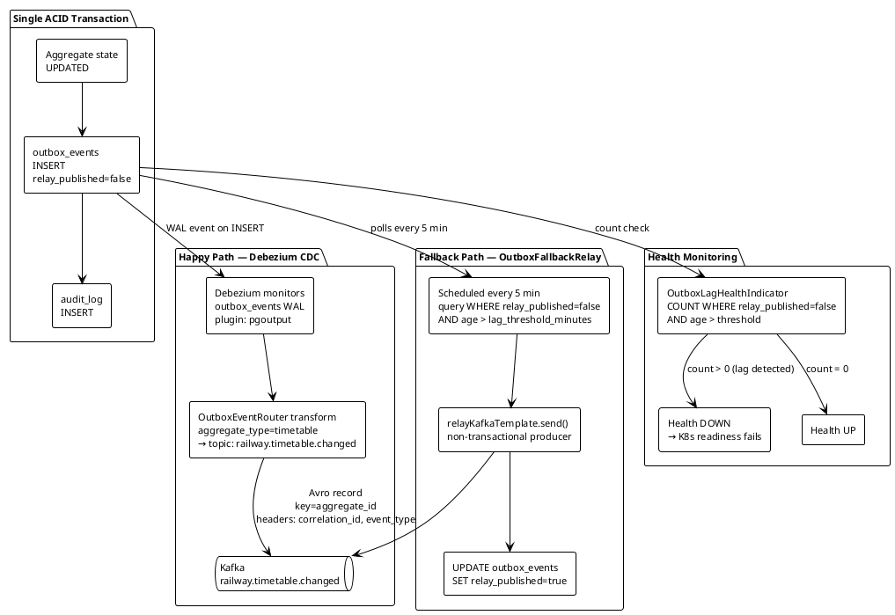
```plantuml
@startuml outbox-relay
!theme plain
skinparam defaultFontSize 11
skinparam componentStyle rectangle

package "Single ACID Transaction" {
  [Aggregate state\nUPDATED] as A
  [outbox_events\nINSERT\nrelay_published=false] as OE
  [audit_log\nINSERT] as AL
}

package "Happy Path — Debezium CDC" {
  [Debezium monitors\noutbox_events WAL\nplugin: pgoutput] as DEZ
  [OutboxEventRouter transform\naggregate_type=timetable\n→ topic: railway.timetable.changed] as RT
  queue "Kafka\nrailway.timetable.changed" as KF1
}

package "Fallback Path — OutboxFallbackRelay" {
  [Scheduled every 5 min\nquery WHERE relay_published=false\nAND age > lag_threshold_minutes] as SCHED
  [relayKafkaTemplate.send()\nnon-transactional producer] as PUB
  [UPDATE outbox_events\nSET relay_published=true] as UPD
}

package "Health Monitoring" {
  [OutboxLagHealthIndicator\nCOUNT WHERE relay_published=false\nAND age > threshold] as LAG
  [Health DOWN\n→ K8s readiness fails] as DN
  [Health UP] as UP
}

A --> OE
OE --> AL
OE --> DEZ : WAL event on INSERT
DEZ --> RT
RT --> KF1 : Avro record\nkey=aggregate_id\nheaders: correlation_id, event_type

OE --> SCHED : polls every 5 min
SCHED --> PUB
PUB --> KF1
PUB --> UPD

OE --> LAG : count check
LAG --> DN : count > 0 (lag detected)
LAG --> UP : count = 0

@enduml
```

### 4.4 Database Schema (timetable-service)

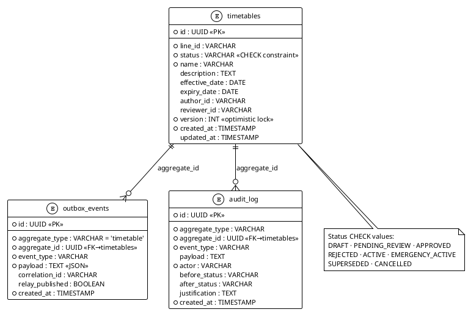
```plantuml
@startuml db-schema-timetable
!theme plain
skinparam defaultFontSize 11

entity "timetables" as T {
  * id : UUID <<PK>>
  --
  * line_id : VARCHAR
  * status : VARCHAR <<CHECK constraint>>
  * name : VARCHAR
  description : TEXT
  effective_date : DATE
  expiry_date : DATE
  author_id : VARCHAR
  reviewer_id : VARCHAR
  * version : INT <<optimistic lock>>
  * created_at : TIMESTAMP
  updated_at : TIMESTAMP
}

entity "outbox_events" as OE {
  * id : UUID <<PK>>
  --
  * aggregate_type : VARCHAR = 'timetable'
  * aggregate_id : UUID <<FK→timetables>>
  * event_type : VARCHAR
  * payload : TEXT <<JSON>>
  correlation_id : VARCHAR
  relay_published : BOOLEAN
  * created_at : TIMESTAMP
}

entity "audit_log" as AL {
  * id : UUID <<PK>>
  --
  * aggregate_type : VARCHAR
  * aggregate_id : UUID <<FK→timetables>>
  * event_type : VARCHAR
  payload : TEXT
  * actor : VARCHAR
  before_status : VARCHAR
  after_status : VARCHAR
  justification : TEXT
  * created_at : TIMESTAMP
}

T ||--o{ OE : "aggregate_id"
T ||--o{ AL : "aggregate_id"

note bottom of T
  Status CHECK values:
  DRAFT · PENDING_REVIEW · APPROVED
  REJECTED · ACTIVE · EMERGENCY_ACTIVE
  SUPERSEDED · CANCELLED
end note

@enduml
```

---

## 5. Layer 3 — CDC Transport: Debezium → Kafka

**Config:** `infra/debezium/application.properties`

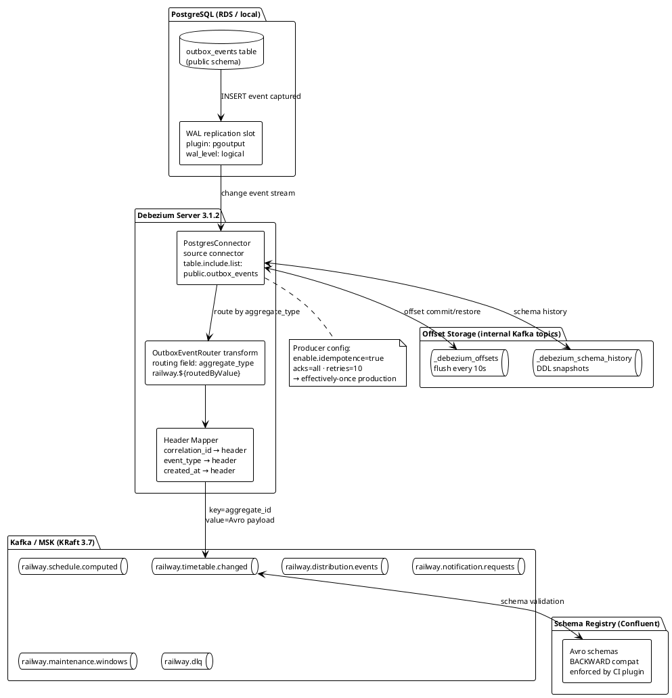
```plantuml
@startuml debezium-cdc
!theme plain
skinparam defaultFontSize 11
skinparam componentStyle rectangle

package "PostgreSQL (RDS / local)" {
  database "outbox_events table\n(public schema)" as OE_TBL
  [WAL replication slot\nplugin: pgoutput\nwal_level: logical] as WAL
}

package "Debezium Server 3.1.2" {
  [PostgresConnector\nsource connector\ntable.include.list:\npublic.outbox_events] as SRC
  [OutboxEventRouter transform\nrouting field: aggregate_type\nrailway.${routedByValue}] as XFM
  [Header Mapper\ncorrelation_id → header\nevent_type → header\ncreated_at → header] as HDR
}

package "Kafka / MSK (KRaft 3.7)" {
  queue "railway.timetable.changed" as T1
  queue "railway.schedule.computed" as T2
  queue "railway.distribution.events" as T3
  queue "railway.notification.requests" as T4
  queue "railway.maintenance.windows" as T5
  queue "railway.dlq" as DLQ
}

package "Schema Registry (Confluent)" {
  [Avro schemas\nBACKWARD compat\nenforced by CI plugin] as SR
}

package "Offset Storage (internal Kafka topics)" {
  queue "_debezium_offsets\nflush every 10s" as OFF
  queue "_debezium_schema_history\nDDL snapshots" as HIST
}

OE_TBL --> WAL : INSERT event captured
WAL --> SRC : change event stream
SRC --> XFM : route by aggregate_type
XFM --> HDR
HDR --> T1 : key=aggregate_id\nvalue=Avro payload

T1 <--> SR : schema validation
SRC <--> OFF : offset commit/restore
SRC <--> HIST : schema history

note bottom of SRC
  Producer config:
  enable.idempotence=true
  acks=all · retries=10
  → effectively-once production
end note

@enduml
```

---

## 6. Layer 4 — Compute Side: Schedule Service

**Port:** 8082 (app) · 8090 (actuator)
**Key files:** `services/schedule-service/src/main/java/com/railway/platform/schedule/`

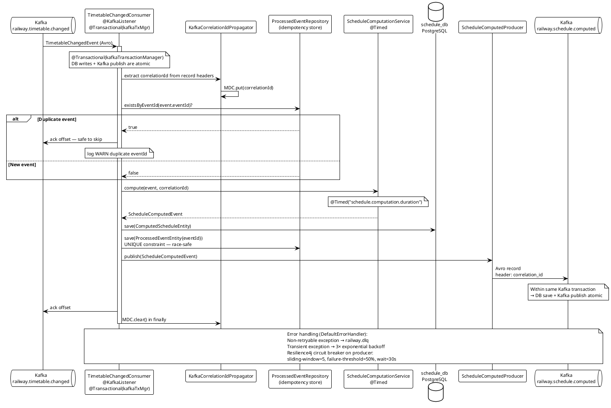
```plantuml
@startuml schedule-service
!theme plain
skinparam defaultFontSize 11
skinparam sequenceMessageAlign left

queue "Kafka\nrailway.timetable.changed" as KF1
participant "TimetableChangedConsumer\n@KafkaListener\n@Transactional(kafkaTxMgr)" as CON
participant "KafkaCorrelationIdPropagator" as PROP
participant "ProcessedEventRepository\n(idempotency store)" as IDEM
participant "ScheduleComputationService\n@Timed" as SCS
database "schedule_db\nPostgreSQL" as DB
participant "ScheduleComputedProducer" as PROD
queue "Kafka\nrailway.schedule.computed" as KF2

KF1 -> CON : TimetableChangedEvent (Avro)
activate CON
note over CON : @Transactional(kafkaTransactionManager)\nDB writes + Kafka publish are atomic

CON -> PROP : extract correlationId from record headers
PROP -> PROP : MDC.put(correlationId)

CON -> IDEM : existsByEventId(event.eventId)?
alt Duplicate event
  IDEM --> CON : true
  CON -> KF1 : ack offset — safe to skip
  note over CON : log WARN duplicate eventId
else New event
  IDEM --> CON : false
end

CON -> SCS : compute(event, correlationId)
note over SCS : @Timed("schedule.computation.duration")
SCS --> CON : ScheduleComputedEvent

CON -> DB : save(ComputedScheduleEntity)
CON -> IDEM : save(ProcessedEventEntity{eventId})\nUNIQUE constraint — race-safe

CON -> PROD : publish(ScheduleComputedEvent)
PROD -> KF2 : Avro record\nheader: correlation_id

note over KF2 : Within same Kafka transaction\n→ DB save + Kafka publish atomic

CON -> KF1 : ack offset
CON -> PROP : MDC.clear() in finally
deactivate CON

note over CON, KF2
  Error handling (DefaultErrorHandler):
  Non-retryable exception → railway.dlq
  Transient exception → 3× exponential backoff
  Resilience4j circuit breaker on producer:
  sliding-window=5, failure-threshold=50%, wait=30s
end note

@enduml
```

---

## 7. Layer 5 — Read Side: Query Service

**Port:** 8083 (app) · 8090 (actuator)
**Key files:** `services/query-service/src/main/java/com/railway/platform/query/`

### 7.1 Event Projection Flow

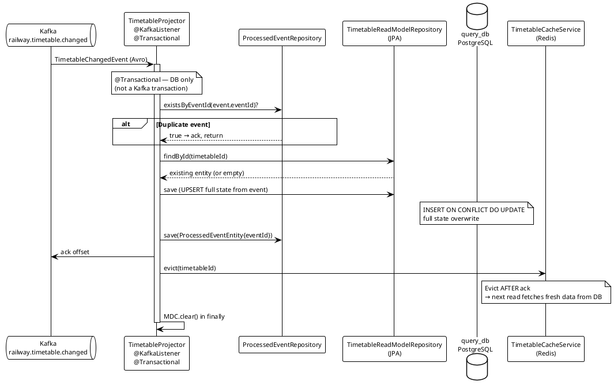
```plantuml
@startuml query-projector
!theme plain
skinparam defaultFontSize 11
skinparam sequenceMessageAlign left

queue "Kafka\nrailway.timetable.changed" as KF
participant "TimetableProjector\n@KafkaListener\n@Transactional" as PROJ
participant "ProcessedEventRepository" as IDEM
participant "TimetableReadModelRepository\n(JPA)" as RM
database "query_db\nPostgreSQL" as DB
participant "TimetableCacheService\n(Redis)" as CACHE

KF -> PROJ : TimetableChangedEvent (Avro)
activate PROJ
note over PROJ : @Transactional — DB only\n(not a Kafka transaction)

PROJ -> IDEM : existsByEventId(event.eventId)?
alt Duplicate event
  IDEM --> PROJ : true → ack, return
end

PROJ -> RM : findById(timetableId)
RM --> PROJ : existing entity (or empty)

PROJ -> RM : save (UPSERT full state from event)
note over DB : INSERT ON CONFLICT DO UPDATE\nfull state overwrite

PROJ -> IDEM : save(ProcessedEventEntity{eventId})
PROJ -> KF : ack offset
PROJ -> CACHE : evict(timetableId)
note over CACHE : Evict AFTER ack\n→ next read fetches fresh data from DB

PROJ -> PROJ : MDC.clear() in finally
deactivate PROJ

@enduml
```

### 7.2 Cache-Aside Read Path

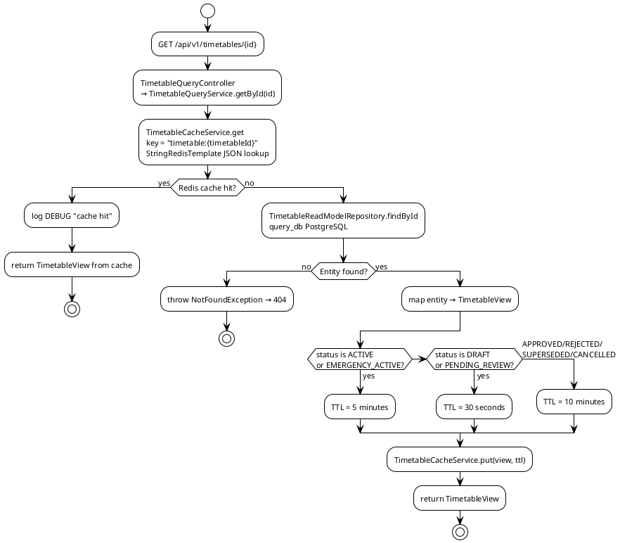
```plantuml
@startuml cache-aside
!theme plain
skinparam defaultFontSize 11

start

:GET /api/v1/timetables/{id};
:TimetableQueryController\n→ TimetableQueryService.getById(id);

:TimetableCacheService.get\nkey = "timetable:{timetableId}"\nStringRedisTemplate JSON lookup;

if (Redis cache hit?) then (yes)
  :log DEBUG "cache hit";
  :return TimetableView from cache;
  stop
else (no)
  :TimetableReadModelRepository.findById\nquery_db PostgreSQL;
  if (Entity found?) then (no)
    :throw NotFoundException → 404;
    stop
  else (yes)
    :map entity → TimetableView;
    if (status is ACTIVE\nor EMERGENCY_ACTIVE?) then (yes)
      :TTL = 5 minutes;
    elseif (status is DRAFT\nor PENDING_REVIEW?) then (yes)
      :TTL = 30 seconds;
    else (APPROVED/REJECTED/\nSUPERSEDED/CANCELLED)
      :TTL = 10 minutes;
    endif
    :TimetableCacheService.put(view, ttl);
    :return TimetableView;
    stop
  endif
endif

@enduml
```

### 7.3 Paginated List Endpoint

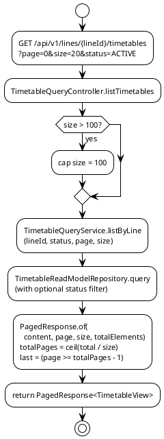
```plantuml
@startuml pagination
!theme plain
skinparam defaultFontSize 11

start
:GET /api/v1/lines/{lineId}/timetables\n?page=0&size=20&status=ACTIVE;
:TimetableQueryController.listTimetables;

if (size > 100?) then (yes)
  :cap size = 100;
endif

:TimetableQueryService.listByLine\n(lineId, status, page, size);
:TimetableReadModelRepository.query\n(with optional status filter);
:PagedResponse.of(\n  content, page, size, totalElements)\ntotalPages = ceil(total / size)\nlast = (page >= totalPages - 1);
:return PagedResponse<TimetableView>;
stop

@enduml
```

---

## 8. Layer 6 — Distribution / Fan-Out: Distribution Service

**Port:** 8084 (app + WebSocket) · 8090 (actuator)
**Key files:** `services/distribution-service/src/main/java/com/railway/platform/distribution/`

### 8.1 Saga Coordination Flow

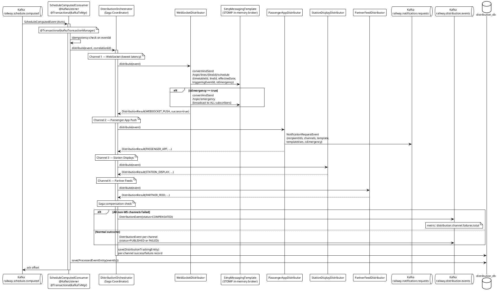
```plantuml
@startuml distribution-saga
!theme plain
skinparam defaultFontSize 11
skinparam sequenceMessageAlign left

queue "Kafka\nrailway.schedule.computed" as KF
participant "ScheduleComputedConsumer\n@KafkaListener\n@Transactional(kafkaTxMgr)" as CON
participant "DistributionOrchestrator\n(Saga Coordinator)" as ORCH
participant "WebSocketDistributor" as WSD
participant "SimpMessagingTemplate\n(STOMP in-memory broker)" as STOMP
participant "PassengerAppDistributor" as PAD
participant "StationDisplayDistributor" as SDD
participant "PartnerFeedDistributor" as PFD
queue "Kafka\nrailway.notification.requests" as NKAF
queue "Kafka\nrailway.distribution.events" as TKAF
database "distribution_db" as DB

KF -> CON : ScheduleComputedEvent (Avro)
activate CON
note over CON : @Transactional(kafkaTransactionManager)

CON -> CON : idempotency check on eventId

CON -> ORCH : distribute(event, correlationId)
activate ORCH

note over ORCH : Channel 1 — WebSocket (lowest latency)
ORCH -> WSD : distribute(event)
WSD -> STOMP : convertAndSend\n/topic/lines/{lineId}/schedule\n{timetableId, lineId, effectiveDate,\ntriggeringEventId, isEmergency}
alt isEmergency == true
  WSD -> STOMP : convertAndSend\n/topic/emergency\n{broadcast to ALL subscribers}
end
WSD --> ORCH : DistributionResult(WEBSOCKET_PUSH, success=true)

note over ORCH : Channel 2 — Passenger App Push
ORCH -> PAD : distribute(event)
PAD -> NKAF : NotificationRequestEvent\n{recipientIds, channels, template,\ntemplateVars, isEmergency}
PAD --> ORCH : DistributionResult(PASSENGER_APP, ...)

note over ORCH : Channel 3 — Station Displays
ORCH -> SDD : distribute(event)
SDD --> ORCH : DistributionResult(STATION_DISPLAY, ...)

note over ORCH : Channel 4 — Partner Feeds
ORCH -> PFD : distribute(event)
PFD --> ORCH : DistributionResult(PARTNER_FEED, ...)

note over ORCH : Saga compensation check
alt All non-WS channels failed
  ORCH -> TKAF : DistributionEvent{status=COMPENSATED}
  note over TKAF : metric: distribution.channel.failures.total
else Normal outcome
  ORCH -> TKAF : DistributionEvent per channel\n{status=PUBLISHED or FAILED}
end

ORCH -> DB : save(DistributionTrackingEntity)\nper-channel success/failure record
deactivate ORCH

CON -> DB : save(ProcessedEventEntity{eventId})
CON -> KF : ack offset
deactivate CON

@enduml
```

### 8.2 WebSocket / STOMP Configuration

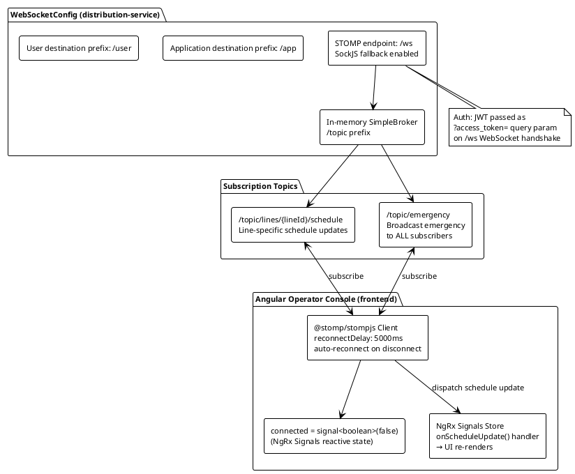
```plantuml
@startuml websocket-config
!theme plain
skinparam defaultFontSize 11
skinparam componentStyle rectangle

package "WebSocketConfig (distribution-service)" {
  [STOMP endpoint: /ws\nSockJS fallback enabled] as EP
  [In-memory SimpleBroker\n/topic prefix] as MB
  [Application destination prefix: /app] as APP
  [User destination prefix: /user] as USR
}

package "Subscription Topics" {
  [/topic/lines/{lineId}/schedule\nLine-specific schedule updates] as S1
  [/topic/emergency\nBroadcast emergency\nto ALL subscribers] as S2
}

package "Angular Operator Console (frontend)" {
  [@stomp/stompjs Client\nreconnectDelay: 5000ms\nauto-reconnect on disconnect] as STOMP_C
  [connected = signal<boolean>(false)\n(NgRx Signals reactive state)] as SIG
  [NgRx Signals Store\nonScheduleUpdate() handler\n→ UI re-renders] as STORE
}

EP --> MB
MB --> S1
MB --> S2
S1 <--> STOMP_C : subscribe
S2 <--> STOMP_C : subscribe
STOMP_C --> SIG
STOMP_C --> STORE : dispatch schedule update

note bottom of EP
  Auth: JWT passed as
  ?access_token= query param
  on /ws WebSocket handshake
end note

@enduml
```

---

## 9. Layer 7 — Notifications: Notification Service

**Port:** 8085 (app) · 8090 (actuator)
**Key files:** `services/notification-service/src/main/java/com/railway/platform/notification/`

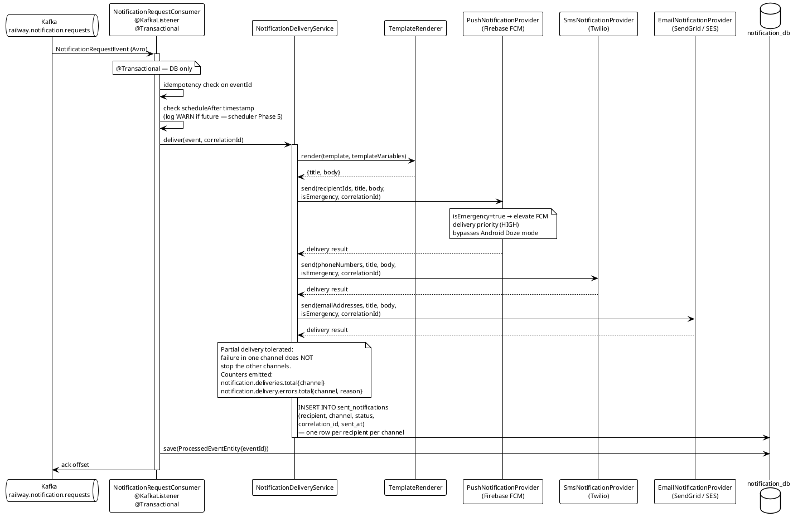
```plantuml
@startuml notification-service
!theme plain
skinparam defaultFontSize 11
skinparam sequenceMessageAlign left

queue "Kafka\nrailway.notification.requests" as KF
participant "NotificationRequestConsumer\n@KafkaListener\n@Transactional" as CON
participant "NotificationDeliveryService" as NDS
participant "TemplateRenderer" as TR
participant "PushNotificationProvider\n(Firebase FCM)" as PUSH
participant "SmsNotificationProvider\n(Twilio)" as SMS
participant "EmailNotificationProvider\n(SendGrid / SES)" as EMAIL
database "notification_db" as DB

KF -> CON : NotificationRequestEvent (Avro)
activate CON
note over CON : @Transactional — DB only

CON -> CON : idempotency check on eventId
CON -> CON : check scheduleAfter timestamp\n(log WARN if future — scheduler Phase 5)

CON -> NDS : deliver(event, correlationId)
activate NDS

NDS -> TR : render(template, templateVariables)
TR --> NDS : {title, body}

NDS -> PUSH : send(recipientIds, title, body,\nisEmergency, correlationId)
note over PUSH : isEmergency=true → elevate FCM\ndelivery priority (HIGH)\nbypasses Android Doze mode
PUSH --> NDS : delivery result

NDS -> SMS : send(phoneNumbers, title, body,\nisEmergency, correlationId)
SMS --> NDS : delivery result

NDS -> EMAIL : send(emailAddresses, title, body,\nisEmergency, correlationId)
EMAIL --> NDS : delivery result

note over NDS
  Partial delivery tolerated:
  failure in one channel does NOT
  stop the other channels.
  Counters emitted:
  notification.deliveries.total{channel}
  notification.delivery.errors.total{channel, reason}
end note

NDS -> DB : INSERT INTO sent_notifications\n(recipient, channel, status,\ncorrelation_id, sent_at)\n— one row per recipient per channel
deactivate NDS

CON -> DB : save(ProcessedEventEntity{eventId})
CON -> KF : ack offset
deactivate CON

@enduml
```

---

## 10. Layer 8 — Observability Stack

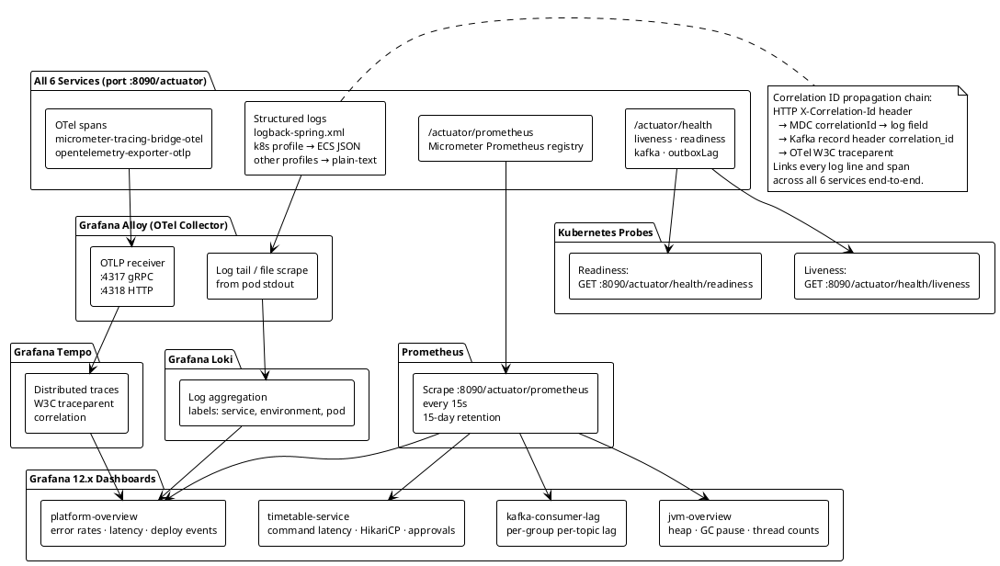
```plantuml
@startuml observability
!theme plain
skinparam componentStyle rectangle
skinparam defaultFontSize 11

package "All 6 Services (port :8090/actuator)" {
  [/actuator/prometheus\nMicrometer Prometheus registry] as PROM_EP
  [/actuator/health\nliveness · readiness\nkafka · outboxLag] as HEALTH_EP
  [OTel spans\nmicrometer-tracing-bridge-otel\nopentelemetry-exporter-otlp] as TRACES
  [Structured logs\nlogback-spring.xml\nk8s profile → ECS JSON\nother profiles → plain-text] as LOGS
}

package "Grafana Alloy (OTel Collector)" {
  [OTLP receiver\n:4317 gRPC\n:4318 HTTP] as OTLP_RCV
  [Log tail / file scrape\nfrom pod stdout] as LOG_SCRAPE
}

package "Grafana Tempo" {
  [Distributed traces\nW3C traceparent\ncorrelation] as TRACE_STORE
}

package "Grafana Loki" {
  [Log aggregation\nlabels: service, environment, pod] as LOG_STORE
}

package "Prometheus" {
  [Scrape :8090/actuator/prometheus\nevery 15s\n15-day retention] as SCRAPE
}

package "Grafana 12.x Dashboards" {
  [platform-overview\nerror rates · latency · deploy events] as D1
  [kafka-consumer-lag\nper-group per-topic lag] as D2
  [timetable-service\ncommand latency · HikariCP · approvals] as D3
  [jvm-overview\nheap · GC pause · thread counts] as D4
}

package "Kubernetes Probes" {
  [Liveness:\nGET :8090/actuator/health/liveness] as LP
  [Readiness:\nGET :8090/actuator/health/readiness] as RP
}

TRACES --> OTLP_RCV
LOGS --> LOG_SCRAPE
OTLP_RCV --> TRACE_STORE
LOG_SCRAPE --> LOG_STORE
PROM_EP --> SCRAPE
TRACE_STORE --> D1
LOG_STORE --> D1
SCRAPE --> D1
SCRAPE --> D2
SCRAPE --> D3
SCRAPE --> D4
HEALTH_EP --> LP
HEALTH_EP --> RP

note right of LOGS
  Correlation ID propagation chain:
  HTTP X-Correlation-Id header
    → MDC correlationId → log field
    → Kafka record header correlation_id
    → OTel W3C traceparent
  Links every log line and span
  across all 6 services end-to-end.
end note

@enduml
```

---

## 11. Layer 9 — Infrastructure: Helm + Terraform + CI/CD

### 11.1 Helm Chart Structure (per service)

```plantuml
@startuml helm-structure
!theme plain
skinparam defaultFontSize 11
skinparam componentStyle rectangle

package "infra/helm/{service}/" {
  [values.yaml\ndefault values] as VALS
  [values-prod.yaml\nproduction overrides:\n- memory requests/limits\n- replica counts\n- HPA CPU target\n- PDB minAvailable] as VALS_P

  package "templates/" {
    [deployment.yaml\nVault Agent sidecar annotations\nreadOnlyRootFilesystem=true\nallowPrivilegeEscalation=false\ncapabilities.drop=[ALL]] as DEP
    [service.yaml\nClusterIP\napp port 808x + actuator 8090] as SVC
    [hpa.yaml\nCPU target 70%\nmin/max replicas] as HPA
    [pdb.yaml\nPodDisruptionBudget\nminAvailable from values] as PDB
    [networkpolicy.yaml\ndeny-all default\negress: DNS·Postgres·Kafka\nRedis·Vault·OTel\napi-gateway ingress: allow all] as NP
    [configmap.yaml\nSPRING_PROFILES_ACTIVE=k8s\nJAVA_OPTS\nSPRING_CONFIG_IMPORT] as CM
    [ingress.yaml\nALB annotations\nACM cert ARN\n(api-gateway only)] as ING
  }
}

package "Vault Agent Sidecar Injector" {
  [vault.hashicorp.com/agent-inject: true\nvault.hashicorp.com/role: {service}\nwrites /vault/secrets/application.properties\ninto in-memory emptyDir volume] as VA
  [Spring Boot loads secrets via\nSPRING_CONFIG_IMPORT env var\nspring.cloud.vault.enabled=false\n(k8s Spring profile)] as BOOT
}

DEP --> VA
VA --> BOOT

@enduml
```

### 11.2 Terraform Module Dependency Graph

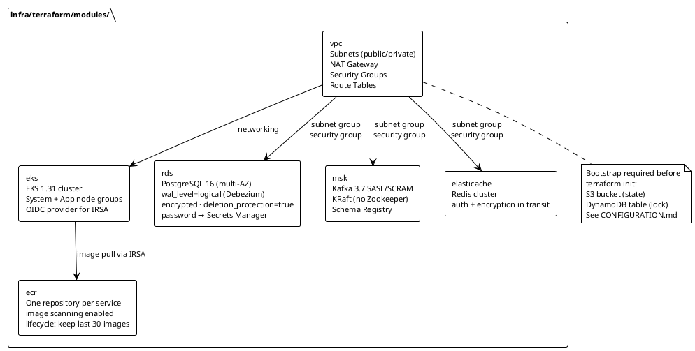
```plantuml
@startuml terraform-modules
!theme plain
skinparam componentStyle rectangle
skinparam defaultFontSize 11

package "infra/terraform/modules/" {
  [vpc\nSubnets (public/private)\nNAT Gateway\nSecurity Groups\nRoute Tables] as VPC

  [eks\nEKS 1.31 cluster\nSystem + App node groups\nOIDC provider for IRSA] as EKS

  [rds\nPostgreSQL 16 (multi-AZ)\nwal_level=logical (Debezium)\nencrypted · deletion_protection=true\npassword → Secrets Manager] as RDS

  [msk\nKafka 3.7 SASL/SCRAM\nKRaft (no Zookeeper)\nSchema Registry] as MSK

  [elasticache\nRedis cluster\nauth + encryption in transit] as EC

  [ecr\nOne repository per service\nimage scanning enabled\nlifecycle: keep last 30 images] as ECR
}

VPC --> EKS : networking
VPC --> RDS : subnet group\nsecurity group
VPC --> MSK : subnet group\nsecurity group
VPC --> EC  : subnet group\nsecurity group
EKS --> ECR : image pull via IRSA

note bottom of VPC
  Bootstrap required before
  terraform init:
  S3 bucket (state)
  DynamoDB table (lock)
  See CONFIGURATION.md
end note

@enduml
```

### 11.3 CI/CD Pipeline Flow

```plantuml
@startuml cicd-pipeline
!theme plain
skinparam defaultFontSize 11

|ci-backend.yml|
start
:Trigger: push to services/**\nshared/** or pom.xml;
:Maven matrix build\n6 services in parallel\nfail-fast: false;
fork
  :mvn test\nunit tests\n(no Docker required);
fork again
  :mvn verify -Dgroups=integration\nTestcontainers:\nPostgres + Kafka + Redis;
end fork
if (Branch is main?) then (yes)
  :docker build\ndocker push :{git-sha}\nto ECR registry;
endif
stop

|ci-frontend.yml|
start
:Trigger: push to frontend/**;
fork
  :ng build\n--configuration=production;
fork again
  :ng test\n--browsers=ChromeHeadless\nKarma + Jasmine + coverage;
fork again
  :ESLint\nflat config Angular 21;
end fork
stop

|security-scan.yml|
start
:Trigger: weekly schedule\n+ every PR;
fork
  :OWASP Dependency Check\nNVD API key (avoids rate limit);
fork again
  :Trivy image scanning\nCRITICAL/HIGH → fail build;
fork again
  :TruffleHog\nsecret scanning;
end fork
stop

|cd-deploy.yml|
start
:Trigger: push to main (dev)\nor manual dispatch (prod);
if (prod deployment?) then (yes)
  :Require GitHub Environment approval;
endif
:helm upgrade --install\n--atomic --wait --timeout 5m\nsequential per service;
:K8s health check\nGET :8090/actuator/health;
:Slack webhook\ndeploy notification;
stop

|dependabot.yml|
start
:Weekly Monday schedule;
fork
  :Maven updates\n(ignore Spring Boot/Cloud major);
fork again
  :npm updates\n(ignore Angular/NgRx major);
fork again
  :GitHub Actions updates;
end fork
stop

@enduml
```

---

## 12. End-to-End Flow: Timetable Change to Passenger Notification

This trace follows a single timetable approval from operator click through to push notification, annotated with latency budgets targeting the ≤5 s (p95) platform SLA.

```plantuml
@startuml e2e-normal
!theme plain
skinparam defaultFontSize 10
skinparam sequenceMessageAlign left

actor "Operator Browser\n(Angular 21)" as OP
participant "API Gateway :8080" as GW
participant "Timetable Service :8081" as TS
database "timetable_db" as PGTS
participant "Debezium CDC" as DEZ
queue "Kafka\nrailway.timetable.changed" as KF1
participant "Query Service :8083" as QS
participant "Redis" as REDIS
participant "Schedule Service :8082" as SS
queue "Kafka\nrailway.schedule.computed" as KF2
participant "Distribution Service :8084" as DS
participant "WebSocket STOMP" as WS
queue "Kafka\nrailway.notification.requests" as KF3
participant "Notification Service :8085" as NS
participant "Firebase FCM" as FCM

== ① HTTP Write Path (~50 ms) ==

OP -> GW : POST /api/v1/timetables/{id}/approve\nAuthorization: Bearer {JWT ROLE_TIMETABLE_APPROVER}
GW -> GW : JWT validate · RBAC check\nrate limit · circuit breaker
GW -> TS : POST .../approve\nX-Correlation-Id: {uuid}
TS -> PGTS : UPDATE timetables (version++)\nINSERT outbox_events {status=APPROVED}\nINSERT audit_log\n— single ACID COMMIT
TS -> GW : 200 OK {timetableId, status: APPROVED}
GW -> OP : 200 OK

== ② Debezium CDC (~100 ms) ==

PGTS -> DEZ : WAL event: outbox_events INSERT
DEZ -> KF1 : TimetableChangedEvent(changeType=APPROVED)\nkey=timetableId · header: correlation_id

== ③ Query Projection + Cache Evict (~200 ms) ==

KF1 -> QS : TimetableChangedEvent
QS -> QS : idempotency check
QS -> QS : UPSERT TimetableReadModelEntity(status=APPROVED)
QS -> REDIS : evict(timetableId)
QS -> KF1 : ack offset

== ④ Schedule Computation (~300 ms) ==

KF1 -> SS : TimetableChangedEvent
SS -> SS : idempotency check
SS -> SS : computeServices(event)
SS -> KF2 : ScheduleComputedEvent (Kafka tx)
SS -> KF1 : ack offset

== ⑤ Distribution Fan-Out (~500 ms, WebSocket first) ==

KF2 -> DS : ScheduleComputedEvent
DS -> DS : idempotency check
DS -> WS : STOMP /topic/lines/{lineId}/schedule\n{timetableId, lineId, effectiveDate, isEmergency=false}
WS -> OP : real-time update received (~50 ms sub-path)
note right of OP : NgRx Signals Store.onScheduleUpdate()\nUI re-renders with new timetable status

DS -> KF3 : NotificationRequestEvent\n{recipientIds, channels=[PUSH,SMS,EMAIL],\ntemplate=TIMETABLE_APPROVED}
DS -> KF2 : ack offset

== ⑥ Notification Dispatch (~1–2 s) ==

KF3 -> NS : NotificationRequestEvent
NS -> NS : idempotency check
NS -> NS : TemplateRenderer.render(template, vars)
NS -> FCM : send PUSH to passenger recipientIds
FCM -> FCM : deliver to passenger apps
NS -> NS : record SentNotificationEntity per recipient
NS -> KF3 : ack offset

note over OP, FCM
  Total latency: ≤5 s p95  (platform SLA)
  Correlation ID threads all spans and logs
  across every service hop end-to-end.
end note

@enduml
```

---

## 13. End-to-End Flow: Emergency Activation

Emergency activation bypasses the approval workflow entirely and triggers elevated-priority delivery across all channels.

```plantuml
@startuml e2e-emergency
!theme plain
skinparam defaultFontSize 10
skinparam sequenceMessageAlign left

actor "Emergency Operator\n(ROLE_EMERGENCY_OPERATOR)" as OP
participant "API Gateway :8080" as GW
participant "Timetable Service :8081" as TS
database "timetable_db" as PGTS
queue "Kafka\nrailway.timetable.changed" as KF
participant "Schedule Service :8082" as SS
participant "Distribution Service :8084" as DS
participant "WebSocket STOMP" as WS
participant "Notification Service :8085" as NS
participant "FCM / SMS / Email" as FCM

OP -> GW : POST /api/v1/timetables/{id}/emergency-activate\n{"justification": "track 3 incident — signal failure"}
note right of GW : Highest-priority dedicated route.\nOnly ROLE_EMERGENCY_OPERATOR\npasses RBAC — any other role → 403.

GW -> TS : POST .../emergency-activate

note over TS
  Timetable.activateEmergency(actor, justification)
  ApprovalStateMachine allows:
    DRAFT → EMERGENCY_ACTIVE
    PENDING_REVIEW → EMERGENCY_ACTIVE
  Invariant: justification must not be blank.
end note

TS -> PGTS : UPDATE timetables SET status=EMERGENCY_ACTIVE\nINSERT outbox_events{changeType=EMERGENCY_ACTIVATED}\nINSERT audit_log{justification="track 3 incident..."}\n— single ACID COMMIT

TS -> GW : 200 OK
GW -> OP : 200 OK

PGTS -> KF : Debezium CDC\nTimetableChangedEvent(changeType=EMERGENCY_ACTIVATED)

KF -> SS : TimetableChangedEvent
SS -> KF : ScheduleComputedEvent {isEmergency propagated}

KF -> DS : ScheduleComputedEvent

DS -> WS : STOMP /topic/lines/{lineId}/schedule\n{isEmergency=true}
DS -> WS : STOMP /topic/emergency\n{broadcast to ALL subscribers\nnot limited to lineId}
note right of WS : Emergency broadcast hits ALL\noperator consoles simultaneously

DS -> KF : NotificationRequestEvent{isEmergency=true}

KF -> NS : NotificationRequestEvent
NS -> FCM : FCM — priority=HIGH\n(bypasses Android Doze mode)
NS -> FCM : SMS via Twilio (immediate send)
NS -> FCM : Email (standard delivery)
note right of NS : isEmergency=true elevates\nprovider priority and rate limits\nacross all three channels

@enduml
```

---

## 14. Appendix: Idempotency Pattern (All Consumers)

Every Kafka consumer in the platform follows the identical idempotency recipe, ensuring safe at-least-once delivery.

```plantuml
@startuml idempotency
!theme plain
skinparam defaultFontSize 11

start

:Kafka Message arrives\n(TimetableChangedEvent /\nScheduleComputedEvent /\nNotificationRequestEvent);

:Extract correlationId\nfrom Kafka record headers;
:KafkaCorrelationIdPropagator\n→ MDC.put(correlationId);

:Check processed_events table\nSELECT WHERE event_id = ?;

if (event_id already exists?) then (yes)
  :log WARN "duplicate eventId — skipping";
  :ack Kafka offset\n(safe to acknowledge);
  stop
else (no — new event)
  :Execute business logic\n(projection / computation /\ndistribution / notification);

  :INSERT INTO processed_events\n(event_id, topic, processed_at)\nUNIQUE constraint on event_id;

  if (DataIntegrityViolationException?\n(race between consumer instances)) then (yes)
    :treat as duplicate — safe to skip;
    :ack Kafka offset;
    stop
  endif

  :ack Kafka offset;

  if (Non-retryable exception thrown?) then (yes)
    :DefaultErrorHandler\n→ publish to railway.dlq\n(original-topic header preserved);
    stop
  elseif (Transient exception thrown?) then (yes)
    :Retry 3× exponential backoff\n100 ms → 200 ms → 400 ms;
    if (Still failing after 3 retries?) then (yes)
      :→ railway.dlq;
    endif
    stop
  endif

  :MDC.clear() in finally block;
  stop
endif

@enduml
```

---

*Document generated from source code analysis of `claude/railway-timetable-platform-8bkan`. All class names, file paths, topic names, and configuration values reflect the actual implementation.*
