# Railway Timetable Distribution Platform — Technical Architecture Flows

> Every layer documented below maps directly to code in this repository.
> File paths are relative to the repo root.

---

## Table of Contents

1. [System Overview](#1-system-overview)
2. [Layer 0 — Shared Foundation](#2-layer-0--shared-foundation)
3. [Layer 1 — Edge: API Gateway](#3-layer-1--edge-api-gateway)
4. [Layer 2 — Write Side: Timetable Service](#4-layer-2--write-side-timetable-service)
5. [Layer 3 — CDC Transport: Debezium → Kafka](#5-layer-3--cdc-transport-debezium--kafka)
6. [Layer 4 — Compute Side: Schedule Service](#6-layer-4--compute-side-schedule-service)
7. [Layer 5 — Read Side: Query Service](#7-layer-5--read-side-query-service)
8. [Layer 6 — Distribution / Fan-Out: Distribution Service](#8-layer-6--distribution--fan-out-distribution-service)
9. [Layer 7 — Notifications: Notification Service](#9-layer-7--notifications-notification-service)
10. [Layer 8 — Observability Stack](#10-layer-8--observability-stack)
11. [Layer 9 — Infrastructure: Helm + Terraform + CI/CD](#11-layer-9--infrastructure-helm--terraform--cicd)
12. [End-to-End Flow: Timetable Change to Passenger Notification](#12-end-to-end-flow-timetable-change-to-passenger-notification)
13. [End-to-End Flow: Emergency Activation](#13-end-to-end-flow-emergency-activation)

---

## 1. System Overview

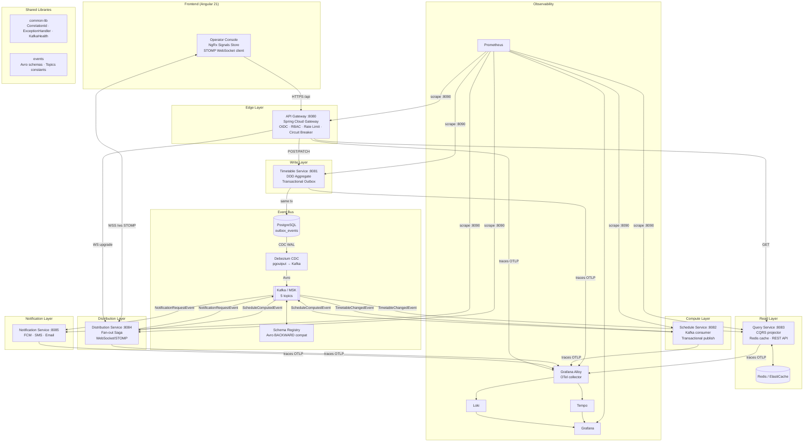

---

## 2. Layer 0 — Shared Foundation

These modules are compiled into every service. They provide the cross-cutting skeleton that the rest of the platform depends on.

### 2.1 Shared Events (`shared/events/`)

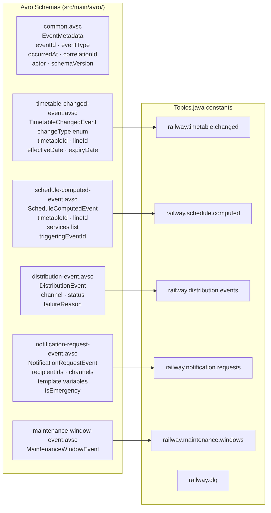

**changeType enum values** on `TimetableChangedEvent`:
`CREATED · UPDATED · SUBMITTED_FOR_REVIEW · APPROVED · REJECTED · ACTIVATED · SUPERSEDED · CANCELLED · EMERGENCY_ACTIVATED · MAINTENANCE_WINDOW_APPLIED`

### 2.2 Common Library (`shared/common-lib/`)

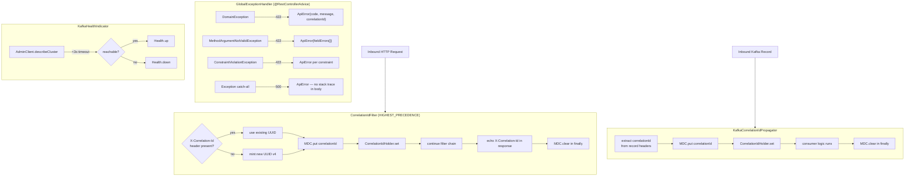

---

## 3. Layer 1 — Edge: API Gateway

**Port:** 8080 (app) · 8090 (actuator)
**Key files:** `services/api-gateway/src/main/java/com/railway/platform/gateway/config/`

### 3.1 Request Processing Pipeline

```mermaid
flowchart TD
    CLIENT[Browser / Mobile App] -->|HTTPS| LB[AWS ALB\nACM TLS termination]
    LB -->|HTTP| GW

    subgraph GW["API Gateway (Spring Cloud Gateway — WebFlux)"]
        direction TB
        SEC[SecurityWebFilterChain\nJWT decoder\nNimbusReactiveJwtDecoder] --> RBAC

        subgraph RBAC["Role-Based Authorization"]
            R1["EMERGENCY_OPERATOR\n→ POST /*/emergency-activate"]
            R2["TIMETABLE_APPROVER or ADMIN\n→ POST /*/approve /reject /request-changes"]
            R3["TIMETABLE_AUTHOR or ADMIN\n→ POST create · submit · cancel\n   PATCH update"]
            R4["Authenticated\n→ all other /api/** + /ws/**"]
            R5["Public\n→ /actuator/health /actuator/info /fallback/**"]
        end

        RBAC --> ROUTER

        subgraph ROUTER["GatewayRoutesConfig — CQRS Routing"]
            WS["WS /ws/** → distribution-service:8084\n(circuit breaker only, no rate limit)"]
            EMG["POST /*/emergency-activate → timetable-service:8081\n(emergency-activate circuit breaker)"]
            WRT["POST/PATCH /api/v1/timetables/** → timetable-service:8081\n(timetable-write circuit breaker)"]
            RD["GET /api/v1/** → query-service:8083\n(query-read circuit breaker)"]
        end

        ROUTER --> RL

        subgraph RL["RedisRateLimiter (RateLimitConfig)"]
            RLK{JWT present?}
            RLK -->|yes| RLU["key = user:{JWT.sub}\nper-user token bucket"]
            RLK -->|no| RLI["key = ip:{X-Forwarded-For}\nper-IP token bucket"]
            RLU & RLI -->|default 100 req/s, burst 200| RLC{tokens available?}
            RLC -->|yes| PASS[consume 1 token → forward]
            RLC -->|no| R429[429 Too Many Requests]
        end

        RL --> CB

        subgraph CB["Resilience4j Circuit Breaker"]
            CBS[sliding window 10 calls\n50% failure threshold\n30s wait in OPEN] --> CBT{state?}
            CBT -->|CLOSED| FWD[forward to upstream]
            CBT -->|OPEN| F503[503 → /fallback/{service}]
            CBT -->|HALF_OPEN| PROBE[allow 3 probe calls]
        end
    end

    CB --> TS[timetable-service]
    CB --> QS[query-service]
    CB --> DS[distribution-service]

    subgraph HDRS["Headers Added to Upstream"]
        H1["X-Correlation-Id: {uuid}"]
        H2["Authorization: Bearer {JWT}  (passed through)"]
        H3["X-Forwarded-For, X-Forwarded-Host"]
    end
```

### 3.2 JWT Authority Mapping

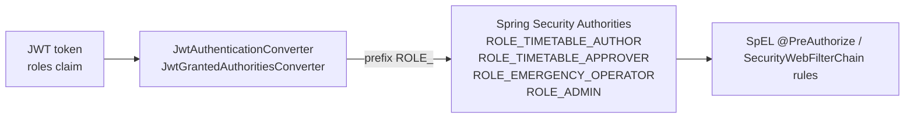

---

## 4. Layer 2 — Write Side: Timetable Service

**Port:** 8081 (app) · 8090 (actuator)
**Key files:** `services/timetable-service/src/main/java/com/railway/platform/timetable/`

### 4.1 Domain Model — Approval State Machine

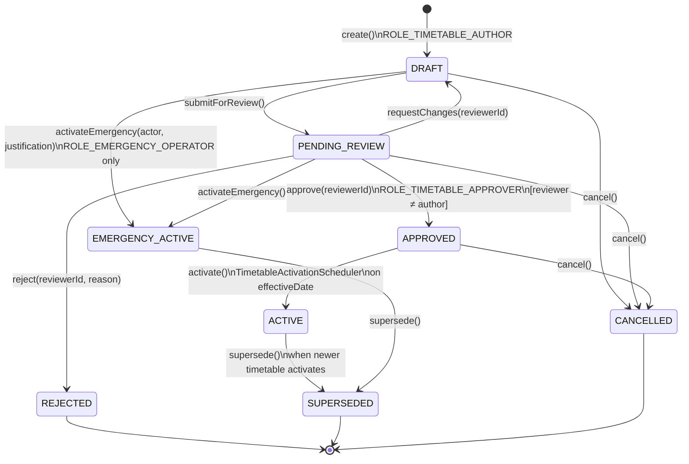

**Invariants enforced in `Timetable.java`:**
- No self-approval: `reviewer ≠ author` checked before `approve()`
- `activateEmergency()` requires explicit `justification` string (written to audit log)
- `ApprovalStateMachine.validateTransition()` guards every state change — throws `InvalidStateTransitionException` on illegal moves

### 4.2 Command Handler Transaction Flow

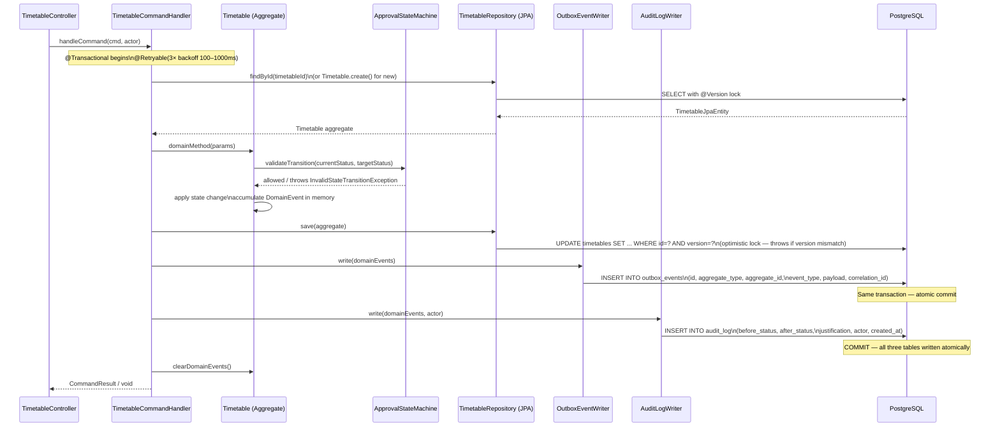

**`@Timed` metrics emitted on each command:**
`timetable.command.duration{command="approve"}`, `timetable.approvals.total`, `timetable.emergency_activations.total`

### 4.3 Transactional Outbox + Fallback Relay

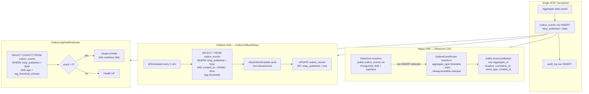

### 4.4 Database Schema (timetable-service)

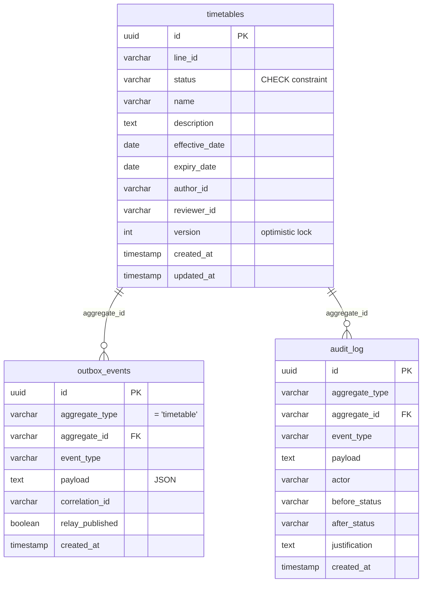

---

## 5. Layer 3 — CDC Transport: Debezium → Kafka

**Config:** `infra/debezium/application.properties`

```mermaid
flowchart LR
    subgraph PG["PostgreSQL (RDS / local)"]
        WAL[WAL replication slot\nplugin: pgoutput\nwal_level: logical]
        OE_TBL[public.outbox_events\n table]
    end

    subgraph DEZ["Debezium Server 3.1.2"]
        SRC[PostgresConnector\nsource connector]
        XFM[OutboxEventRouter transform\nrouting field: aggregate_type\ntopic: railway.$-{routedByValue}]
        HDRMAPPER[Header mapper\ncorrelation_id → Kafka header\nevent_type → Kafka header\ncreated_at → Kafka header]
    end

    subgraph KF["Kafka / MSK (KRaft, 3.7)"]
        T1[railway.timetable.changed]
        T2[railway.schedule.computed]
        T3[railway.distribution.events]
        T4[railway.notification.requests]
        T5[railway.maintenance.windows]
        DLQ[railway.dlq]
    end

    subgraph SR["Schema Registry (Confluent)"]
        AVRO[Avro schemas\nBACKWARD compat enforced\nby CI plugin]
    end

    subgraph OS["Offset Storage (Kafka topics)"]
        OFF[_debezium_offsets\nflush every 10s]
        HIST[_debezium_schema_history\nDDL snapshots]
    end

    OE_TBL -->|CDC INSERT events| WAL
    WAL --> SRC
    SRC --> XFM
    XFM --> HDRMAPPER
    HDRMAPPER -->|key=aggregate_id\nvalue=Avro payload| T1
    KF <-->|schema validation| SR
    DEZ <--> OS

    style DEZ fill:#f0f4ff
    style KF fill:#fff8e1
```

**Delivery guarantees:**
- `enable.idempotence=true` + `acks=all` + `retries=10` → **effectively-once** production from Debezium
- Consumers use idempotency check on `eventId` → **at-least-once** consumed safely

---

## 6. Layer 4 — Compute Side: Schedule Service

**Port:** 8082 (app) · 8090 (actuator)
**Key files:** `services/schedule-service/src/main/java/com/railway/platform/schedule/`

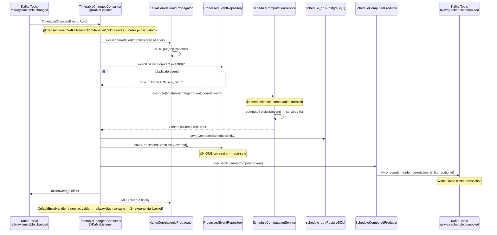

**Resilience4j circuit breaker** wraps Kafka producer calls:
- `sliding-window-size: 5`, `failure-rate-threshold: 50%`, `wait-duration-in-open-state: 30s`

---

## 7. Layer 5 — Read Side: Query Service

**Port:** 8083 (app) · 8090 (actuator)
**Key files:** `services/query-service/src/main/java/com/railway/platform/query/`

### 7.1 Event Projection Flow

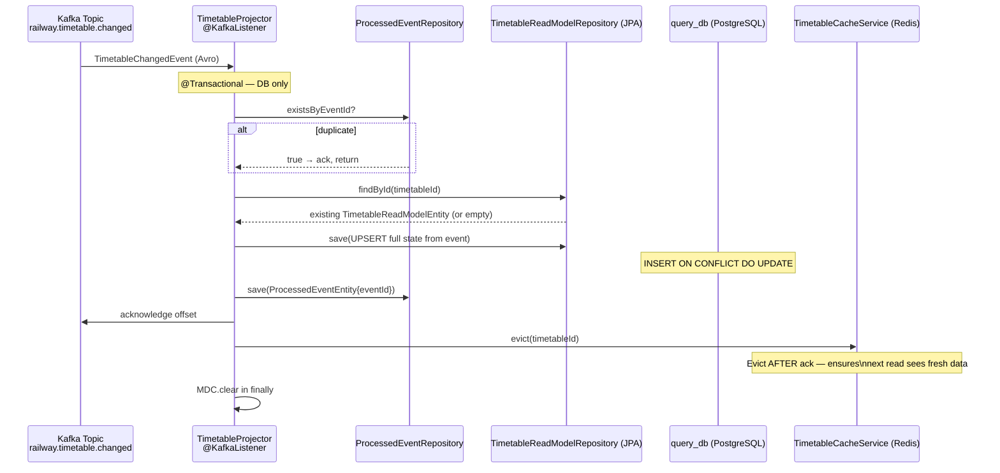

### 7.2 Cache-Aside Read Path

```mermaid
flowchart TD
    CLIENT[GET /api/v1/timetables/:id] --> CTL[TimetableQueryController]
    CTL --> QS[TimetableQueryService.getById]

    QS --> CGET[TimetableCacheService.get\nkey: timetable:{timetableId}]

    CGET --> HIT{Redis hit?}
    HIT -->|yes| RET1[return TimetableView\nfrom cache]
    HIT -->|no| DB[TimetableReadModelRepository.findById\nquery_db PostgreSQL]

    DB --> FOUND{found?}
    FOUND -->|no| E404[throw NotFoundException → 404]
    FOUND -->|yes| MAP[map entity → TimetableView]

    MAP --> TTL{status?}
    TTL -->|ACTIVE / EMERGENCY_ACTIVE| T5m[TTL = 5 minutes]
    TTL -->|DRAFT / PENDING_REVIEW| T30s[TTL = 30 seconds]
    TTL -->|APPROVED / REJECTED / SUPERSEDED / CANCELLED| T10m[TTL = 10 minutes]

    T5m & T30s & T10m --> PUT[TimetableCacheService.put\nStringRedisTemplate JSON]
    PUT --> RET2[return TimetableView]

    subgraph PAGED["GET /api/v1/lines/:lineId/timetables?page=0&size=20&status=ACTIVE"]
        PQ[listByLine\npage max 100] --> PDB[Repository query\nwith optional status filter]
        PDB --> PMAP["PagedResponse.of(content, page, size, totalElements)\ntotalPages = ceil(total/size)\nlast = page >= totalPages-1"]
    end
```

---

## 8. Layer 6 — Distribution / Fan-Out: Distribution Service

**Port:** 8084 (app + WebSocket) · 8090 (actuator)
**Key files:** `services/distribution-service/src/main/java/com/railway/platform/distribution/`

### 8.1 Saga Coordination Flow

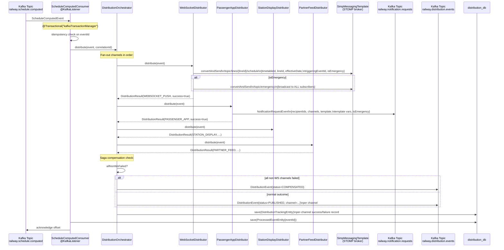

### 8.2 WebSocket / STOMP Layer

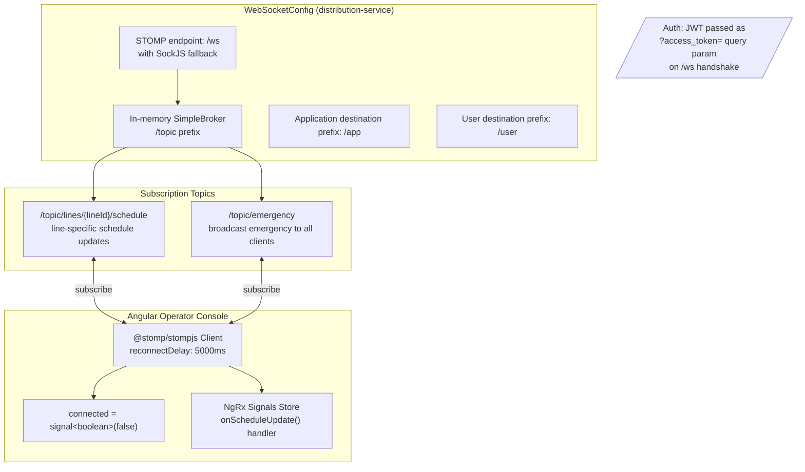

---

## 9. Layer 7 — Notifications: Notification Service

**Port:** 8085 (app) · 8090 (actuator)
**Key files:** `services/notification-service/src/main/java/com/railway/platform/notification/`

```mermaid
sequenceDiagram
    participant KF as Kafka Topic<br/>railway.notification.requests
    participant CON as NotificationRequestConsumer<br/>@KafkaListener
    participant NDS as NotificationDeliveryService
    participant TR as TemplateRenderer
    participant PUSH as PushNotificationProvider<br/>(Firebase FCM)
    participant SMS as SmsNotificationProvider<br/>(Twilio)
    participant EMAIL as EmailNotificationProvider<br/>(SendGrid / SES)
    participant DB as notification_db

    KF->>CON: NotificationRequestEvent (Avro)
    note over CON: @Transactional — DB only

    CON->>CON: idempotency check on eventId
    CON->>CON: check scheduleAfter timestamp\n(log WARN if future — scheduler in Phase 5)

    CON->>NDS: deliver(event, correlationId)

    NDS->>TR: render(template, templateVariables)
    TR-->>NDS: {title, body}

    loop for each NotificationChannel (PUSH, SMS, EMAIL)
        NDS->>NDS: resolve provider from\nMap&lt;NotificationChannel, NotificationProvider&gt;

        alt PUSH channel
            NDS->>PUSH: send(recipientIds, title, body,\nisEmergency, correlationId)
            PUSH->>PUSH: elevate priority if isEmergency
            PUSH-->>NDS: delivery result
        else SMS channel
            NDS->>SMS: send(phoneNumbers, title, body, ...)
            SMS-->>NDS: delivery result
        else EMAIL channel
            NDS->>EMAIL: send(emailAddresses, title, body, ...)
            EMAIL-->>NDS: delivery result
        end

        NDS->>DB: INSERT INTO sent_notifications\n(recipient, channel, status,\ncorrelation_id, sent_at)
    end

    note over NDS: Counters:\nnotification.deliveries.total{channel}\nnotification.delivery.errors.total{channel, reason}
    note over NDS: Partial delivery tolerated:\nfailure in one channel does NOT\nstop others

    CON->>DB: save(ProcessedEventEntity{eventId})
    CON->>KF: acknowledge offset
```

---

## 10. Layer 8 — Observability Stack

```mermaid
flowchart TD
    subgraph SVCS["All 6 Services (:8090/actuator)"]
        PROM_EP[/actuator/prometheus\nMicrometer Prometheus registry]
        HEALTH_EP[/actuator/health\nliveness · readiness · kafka · outboxLag]
        TRACES[OTel spans\nmicrometer-tracing-bridge-otel\nopentelemetry-exporter-otlp]
        LOGS[Structured logs\nlogback-spring.xml\nSpringProfile k8s → ECS JSON\nSpringProfile !k8s → plain-text]
    end

    subgraph ALLOY["Grafana Alloy (OTel Collector)"]
        OTLP_RCV[OTLP receiver\n:4317 gRPC · :4318 HTTP]
        LOG_SCRAPE[Log tail / file scrape\nfrom pod stdout]
    end

    subgraph TEMPO["Grafana Tempo"]
        TRACE_STORE[Distributed traces\nW3C traceparent correlation]
    end

    subgraph LOKI["Grafana Loki"]
        LOG_STORE[Log aggregation\nlabels: service, environment, pod]
    end

    subgraph PROM["Prometheus"]
        SCRAPE[Scrape :8090/actuator/prometheus\nevery 15s] --> TSDB[Time-series DB\n15-day retention]
    end

    subgraph GRAFANA["Grafana 12.x Dashboards"]
        D1[platform-overview\nerror rates · latency · deploy events]
        D2[kafka-consumer-lag\nper-group per-topic lag]
        D3[timetable-service\ncommand latency · HikariCP · approvals]
        D4[jvm-overview\nheap · GC pause · thread counts]
    end

    subgraph K8S["Kubernetes Probes"]
        LP[Liveness: GET :8090/actuator/health/liveness]
        RP[Readiness: GET :8090/actuator/health/readiness]
    end

    TRACES --> ALLOY
    LOGS --> ALLOY
    ALLOY --> TEMPO
    ALLOY --> LOKI
    PROM_EP --> PROM
    TEMPO --> GRAFANA
    LOKI --> GRAFANA
    PROM --> GRAFANA
    HEALTH_EP --> K8S

    subgraph CORR["Correlation ID Propagation Chain"]
        C1[HTTP X-Correlation-Id header]
        C2[MDC correlationId → log field]
        C3[Kafka record header correlation_id]
        C4[OTel W3C traceparent]
        C1 --> C2 --> C3 --> C4
    end
```

---

## 11. Layer 9 — Infrastructure: Helm + Terraform + CI/CD

### 11.1 Helm Chart Structure (per service)

```mermaid
flowchart TD
    subgraph CHART["infra/helm/{service}/"]
        VALS[values.yaml\ndefault values]
        VALS_P[values-prod.yaml\nproduction overrides]
        subgraph TEMPLATES["templates/"]
            DEP[deployment.yaml\nVault Agent sidecar annotations\nreadOnlyRootFilesystem\nallowPrivilegeEscalation=false\ncapabilities.drop=[ALL]]
            SVC[service.yaml\nClusterIP app:808x + actuator:8090]
            HPA[hpa.yaml\nCPU 70% target\nmin/max replicas]
            PDB[pdb.yaml\nPodDisruptionBudget\nminAvailable from values]
            NP[networkpolicy.yaml\ndeny-all default\nexplicit egress: DNS·Postgres·Kafka·Redis·Vault·OTel\napi-gateway ingress: allow all]
            CM[configmap.yaml\nSPRING_PROFILES_ACTIVE=k8s\nJAVA_OPTS]
            ING[ingress.yaml\nALB annotations\nACM cert ARN\n(api-gateway only)]
        end
    end

    subgraph VAULT_SIDECAR["Vault Agent Sidecar Injector"]
        VA[vault.hashicorp.com/agent-inject: true\nvault.hashicorp.com/role: {service}\nwrites to /vault/secrets/application.properties\nas in-memory emptyDir]
        BOOT[Spring Boot loads via\nSPRING_CONFIG_IMPORT env var\nspring.cloud.vault.enabled=false in k8s profile]
    end

    DEP --> VAULT_SIDECAR
```

### 11.2 Terraform Module Dependency Graph

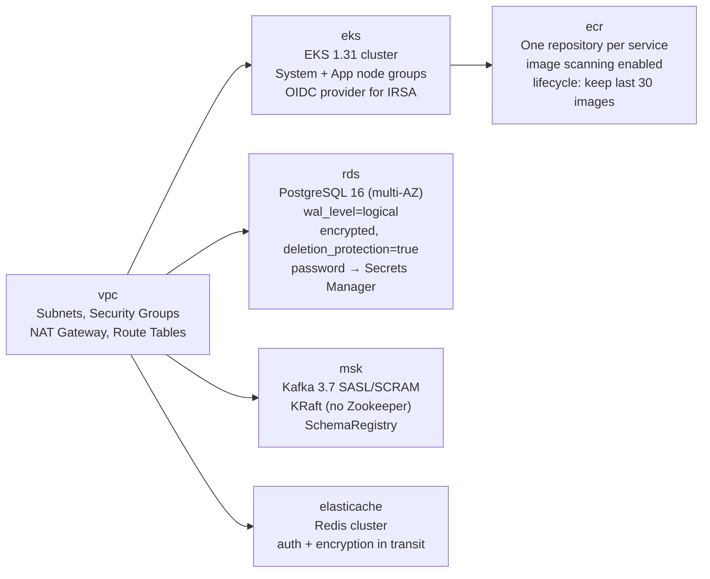

### 11.3 CI/CD Pipeline Flow

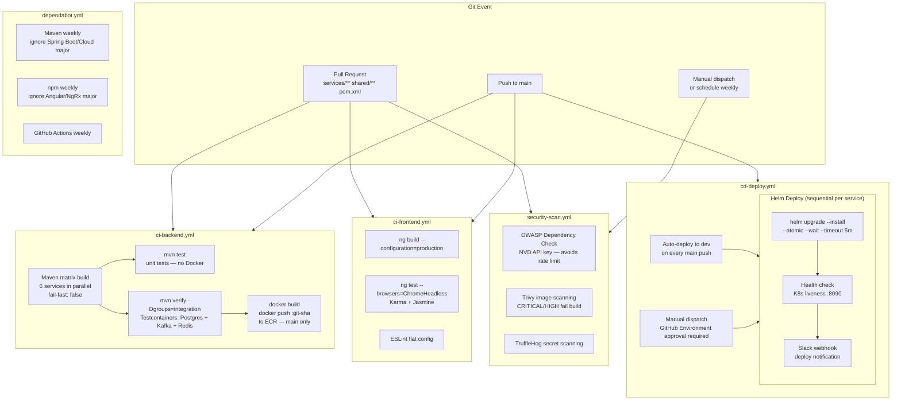

---

## 12. End-to-End Flow: Timetable Change to Passenger Notification

This trace follows a single timetable approval from operator click to push notification, showing every layer in sequence with latency budgets.

```mermaid
sequenceDiagram
    participant OP as Operator Browser<br/>(Angular 21)
    participant GW as API Gateway :8080
    participant TS as Timetable Service :8081
    participant PGTS as timetable_db
    participant DEZ as Debezium CDC
    participant KF1 as Kafka<br/>railway.timetable.changed
    participant SS as Schedule Service :8082
    participant KF2 as Kafka<br/>railway.schedule.computed
    participant QS as Query Service :8083
    participant REDIS as Redis
    participant DS as Distribution Service :8084
    participant WS as WebSocket STOMP
    participant KF3 as Kafka<br/>railway.notification.requests
    participant NS as Notification Service :8085
    participant FCM as Firebase FCM

    Note over OP,FCM: ① HTTP Write Path (~50ms)

    OP->>GW: POST /api/v1/timetables/{id}/approve\nAuthorization: Bearer {JWT ROLE_TIMETABLE_APPROVER}
    GW->>GW: JWT validate, RBAC check, rate limit, circuit breaker
    GW->>TS: POST /api/v1/timetables/{id}/approve\n+ X-Correlation-Id header
    TS->>TS: CorrelationIdFilter extracts/mints correlationId
    TS->>PGTS: SELECT timetable (optimistic lock)
    TS->>TS: Timetable.approve() validates state machine\nPENDING_REVIEW → APPROVED
    TS->>PGTS: UPDATE timetables (version++)\nINSERT outbox_events{status=APPROVED}\nINSERT audit_log  ← single ACID commit
    TS->>GW: 200 OK {timetableId, status: APPROVED}
    GW->>OP: 200 OK

    Note over OP,FCM: ② Debezium CDC (~100ms)

    PGTS->>DEZ: WAL event: outbox_events INSERT
    DEZ->>KF1: TimetableChangedEvent(changeType=APPROVED)\nkey=timetableId, header correlation_id

    Note over OP,FCM: ③ Query Projection + Cache Evict (~200ms)

    KF1->>QS: TimetableChangedEvent
    QS->>QS: idempotency check
    QS->>QS: UPSERT TimetableReadModelEntity(status=APPROVED)
    QS->>REDIS: evict(timetableId)
    QS->>KF1: ack offset

    Note over OP,FCM: ④ Schedule Computation (~300ms)

    KF1->>SS: TimetableChangedEvent
    SS->>SS: idempotency check
    SS->>SS: computeServices(event)
    SS->>KF2: ScheduleComputedEvent\n(within Kafka transaction)
    SS->>KF1: ack offset

    Note over OP,FCM: ⑤ Distribution Fan-Out (~500ms total, WebSocket first)

    KF2->>DS: ScheduleComputedEvent
    DS->>DS: idempotency check
    DS->>WS: STOMP /topic/lines/{lineId}/schedule\n{timetableId, lineId, effectiveDate, isEmergency=false}
    WS->>OP: real-time update received (~50ms sub-path)
    OP->>OP: NgRx Signals Store.onScheduleUpdate()\nUI re-renders with new timetable status

    DS->>KF3: NotificationRequestEvent\n{recipientIds, channels=[PUSH,SMS,EMAIL],\ntemplate=TIMETABLE_APPROVED}
    DS->>KF2: ack offset

    Note over OP,FCM: ⑥ Notification Dispatch (~1-2s total)

    KF3->>NS: NotificationRequestEvent
    NS->>NS: idempotency check
    NS->>NS: TemplateRenderer.render(template, vars)
    NS->>FCM: send PUSH to passenger recipientIds
    FCM->>FCM: deliver to passenger apps
    NS->>NS: record SentNotificationEntity per recipient
    NS->>KF3: ack offset

    Note over OP,FCM: Total latency: ≤5s p95 (per platform SLA)
```

---

## 13. End-to-End Flow: Emergency Activation

Emergency activation bypasses the normal approval workflow entirely.

```mermaid
sequenceDiagram
    participant OP as Emergency Operator<br/>(ROLE_EMERGENCY_OPERATOR)
    participant GW as API Gateway
    participant TS as Timetable Service
    participant KF as Kafka
    participant DS as Distribution Service
    participant WS as WebSocket STOMP
    participant NS as Notification Service
    participant FCM as FCM / SMS

    OP->>GW: POST /api/v1/timetables/{id}/emergency-activate\n{justification: "track 3 incident"}
    GW->>GW: RBAC: require ROLE_EMERGENCY_OPERATOR only\n(separate highest-priority route)

    GW->>TS: POST .../emergency-activate

    Note over TS: Timetable.activateEmergency(actor, justification)
    Note over TS: ApprovalStateMachine allows:\nDRAFT → EMERGENCY_ACTIVE\nPENDING_REVIEW → EMERGENCY_ACTIVE
    TS->>TS: INSERT outbox_events{changeType=EMERGENCY_ACTIVATED}\nINSERT audit_log{justification=...} ← same ACID commit

    TS->>GW: 200 OK
    GW->>OP: 200 OK

    TS->>KF: CDC → TimetableChangedEvent(changeType=EMERGENCY_ACTIVATED)

    KF->>DS: ScheduleComputedEvent [after schedule-service]

    DS->>WS: /topic/lines/{lineId}/schedule {isEmergency=true}
    DS->>WS: /topic/emergency {broadcast ALL subscribers}
    Note over WS: Emergency broadcast goes to ALL\noperator consoles, not just lineId subscribers

    DS->>KF: NotificationRequestEvent{isEmergency=true}

    KF->>NS: NotificationRequestEvent

    NS->>FCM: FCM with HIGH priority flag\n(bypasses Doze mode on Android)
    NS->>FCM: SMS via Twilio (immediate)
    Note over NS: isEmergency=true elevates\nprovider priority / rate limits
```

---

## Appendix: Idempotency Pattern (All Consumers)

Every Kafka consumer in the platform follows the identical idempotency recipe:

```mermaid
flowchart TD
    MSG[Kafka Message arrives] --> EXT[Extract correlationId\nfrom record headers]
    EXT --> CHECK{processed_events\ncontains eventId?}

    CHECK -->|YES — duplicate| LOG[log WARN duplicate eventId]
    LOG --> ACK_D[ack offset — safe to skip]

    CHECK -->|NO — new event| PROC[process business logic]
    PROC --> SAVE_PE["INSERT INTO processed_events\n(event_id, topic, processed_at)\nUNIQUE constraint on event_id"]

    SAVE_PE --> RACE{DataIntegrityViolation?\nrace between consumers}
    RACE -->|yes| LOG2[treat as duplicate — safe]
    RACE -->|no| ACK[ack offset]

    PROC --> DLQ_CHECK{non-retryable exception?}
    DLQ_CHECK -->|yes| DLQ[DefaultErrorHandler\n→ railway.dlq\nwith original topic header]
    DLQ_CHECK -->|no — transient| RETRY[retry 3× exponential backoff\n100ms · 200ms · 400ms]
```

---

*Document generated from source code analysis of `claude/railway-timetable-platform-8bkan`. All class names, file paths, topic names, and configuration values reflect the actual implementation.*
