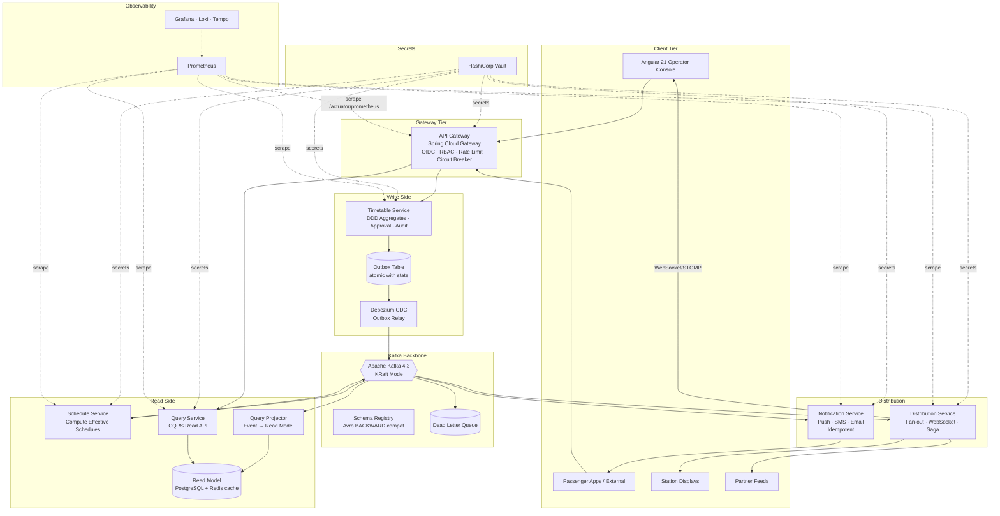
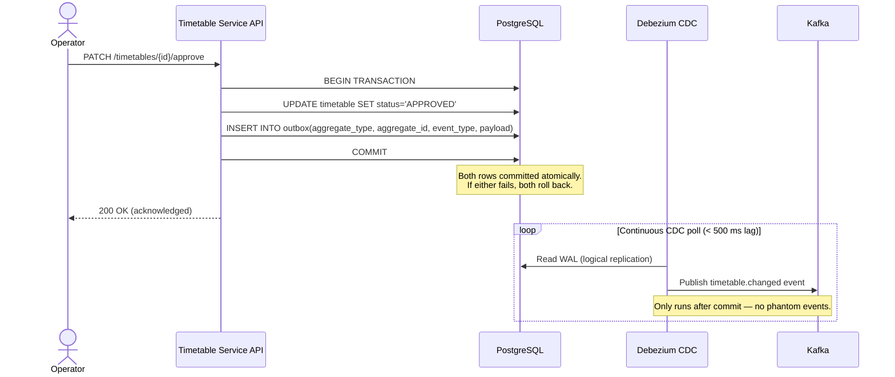
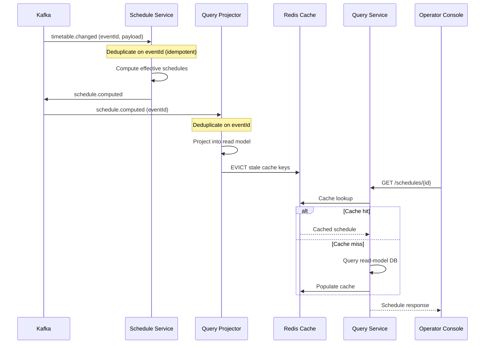
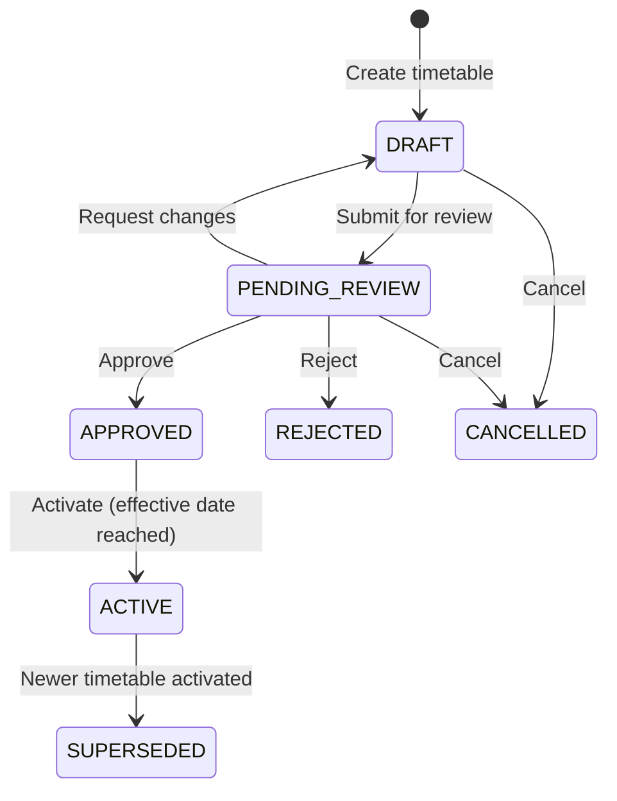
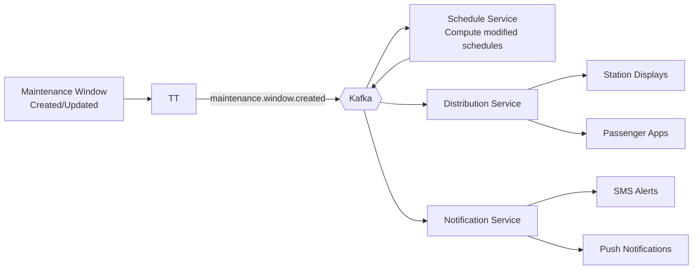

# System Architecture

## Overview

The Railway Timetable Distribution Platform is an event-driven, CQRS microservices system. Operators author and approve timetables via a central console; changes propagate in ≤5 s (p95) to passenger apps, station displays, and partner feeds through a Kafka backbone.

The two central reliability guarantees are:
1. **Zero acknowledged-write loss** — the Transactional Outbox pattern ensures a timetable write is either fully committed (including its Kafka event) or fully rolled back. There is no window where a state change commits but its event is lost.
2. **Idempotent consumers** — every downstream consumer deduplicates on `eventId`, so Kafka's at-least-once delivery never causes double-processing.

---

## High-Level Component Diagram



---

## Transactional Outbox Pattern

The single most important reliability mechanism in the system. Without it, a service could commit a database write but fail before publishing the Kafka event, leaving state and events permanently inconsistent.



---

## CQRS Event Flow



---

## Approval Workflow State Machine



---

## Track Maintenance Integration

Railway track maintenance windows affect active timetables. When a maintenance window is created or modified, the system:

1. Checks all `ACTIVE` timetables for affected train paths.
2. Emits a `maintenance.window.created` event.
3. Schedule Service computes an emergency/modified schedule.
4. Distribution Service pushes updates to all channels.
5. Notification Service alerts affected passengers and operators.



---

## Emergency Timetable Updates

Emergency updates bypass the normal approval workflow. An operator with `EMERGENCY_OPERATOR` role can publish directly to `ACTIVE` status. The system:

1. Records the emergency override in the immutable audit log with mandatory justification.
2. Skips `PENDING_REVIEW` state; goes `DRAFT → EMERGENCY_ACTIVE`.
3. All downstream events are marked `priority=EMERGENCY` so consumers and distribution channels prioritise them.
4. Post-hoc review is required within 24 hours; a reminder notification is scheduled.

---

## Correlation ID Propagation Chain

The correlation ID ensures a single user request can be traced across every service and Kafka hop.

```
Browser → X-Correlation-Id header
  → API Gateway (mints if absent, propagates)
    → Service MDC (logged on every line)
      → Kafka record header: correlationId
        → Consumer MDC (restored from header)
          → Response header back to browser
```

All structured log lines include `"correlationId": "..."`. OpenTelemetry trace context is propagated in parallel via W3C `traceparent` header and Kafka record headers.

---

## Failure Modes and Mitigations

| Failure | Detection | Mitigation |
|---------|-----------|-----------|
| DB write fails | Transaction rollback | Outbox row also rolled back; no phantom event |
| Debezium lag / crash | Kafka consumer lag alert | Debezium resumes from last WAL position; no event loss |
| Kafka broker unavailable | Outbox relay retry | Debezium retries with backoff; at-most 30 s window before alert |
| Consumer processing error (transient) | Exception caught | Exponential backoff retry (3 attempts); then → DLQ |
| Consumer processing error (poison) | Deserialization / invariant failure | Straight to DLQ; alert fires; manual triage |
| Redis cache unavailable | Lettuce connection exception | Fall through to DB; degrade gracefully |
| DB primary failover | HikariCP connection error | Multi-AZ RDS; HikariCP reconnects within 30 s |
| Read model corrupted | Data inconsistency detected | Replay events from Kafka (retention ≥ 7 days) to rebuild |
| API Gateway circuit open | Resilience4j state: OPEN | Return 503 + Retry-After; fallback controller serves last cached |
| WebSocket disconnect | Client-side event | Auto-reconnect with exponential backoff; refetch on resume |

---

## Security Architecture

- **Authentication**: OIDC via external IdP (e.g. AWS Cognito). JWT validated at the gateway.
- **Authorisation**: RBAC roles (`TIMETABLE_AUTHOR`, `TIMETABLE_APPROVER`, `EMERGENCY_OPERATOR`, `ADMIN`, `READ_ONLY`). Enforced at gateway and at service method level (`@PreAuthorize`).
- **Secrets**: HashiCorp Vault. No secret in code, config files, or images. Spring Cloud Vault auto-renews leases.
- **Transport**: TLS 1.3 everywhere. mTLS within the cluster (service mesh or Istio).
- **Data at rest**: RDS storage encrypted (AES-256). Kafka topic encryption at MSK. Redis AUTH + TLS.
- **Audit**: Every state-changing operation recorded in append-only `audit_log` table with actor, timestamp, before/after state, and justification for overrides.

---

## Data Retention

| Data | Retention | Justification |
|------|-----------|--------------|
| Kafka events (all topics) | 7 days | Enables full read-model replay from recent history |
| Audit log (DB) | Indefinite | Regulatory / operational requirement |
| Timetable history (DB) | 2 years | Operational reference; archived after 90 days |
| Read model snapshots | 30 days | Point-in-time debugging |
| Logs (Loki) | 30 days | Operational debugging |
| Traces (Tempo) | 7 days | Performance analysis |
| Metrics (Prometheus) | 15 days | SLO reporting |
