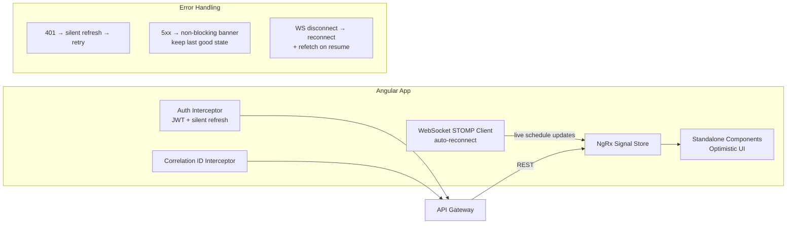

# frontend/operator-console

## Purpose

Angular 21 single-page application for railway operators to author, review, and approve timetables, monitor live distribution status, and manage track maintenance windows. Uses NgRx Signal Store for state management, zoneless change detection, and WebSocket/STOMP for live updates.

## Architecture



## Tech & Versions

| Component | Version |
|-----------|---------|
| Angular | 21.0.x |
| NgRx Signals Store | 19.x |
| TypeScript | 5.8.x |
| Node.js | 22 LTS |

## Run Locally

```bash
cd frontend/operator-console
npm install
npm start
# App available at http://localhost:4200
# Requires API Gateway running at http://localhost:8080
```
