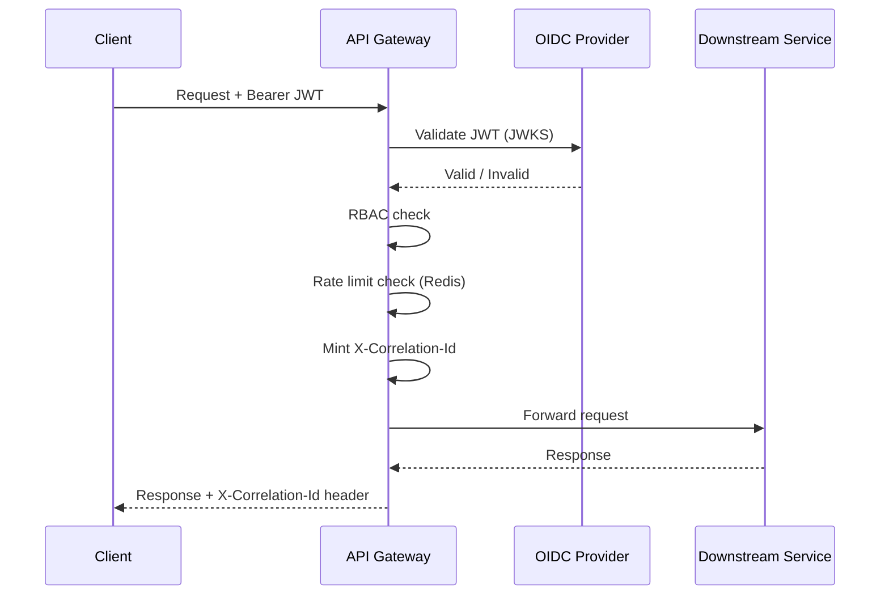

# services/api-gateway

## Purpose

Single entry point for all client traffic. Handles OIDC JWT validation, RBAC enforcement, per-user rate limiting (Redis), Resilience4j circuit breaker + bulkhead, correlation-ID minting, and request routing to downstream services.

## Architecture

## Error Handling

| Scenario | Response |
|----------|---------|
| Invalid JWT | 401 |
| Insufficient role | 403 |
| Rate limit exceeded | 429 + `Retry-After` header |
| Circuit breaker open | 503 + `Retry-After`; fallback controller |
| Bulkhead full | 503 fast-fail |
| Downstream timeout | 504 |
