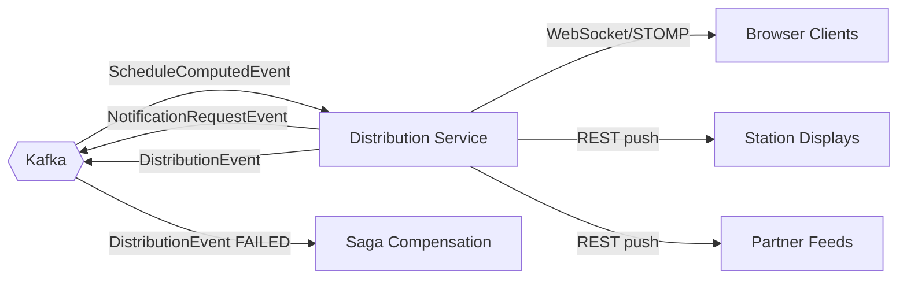

# services/distribution-service

## Purpose

Fan-out service. Consumes `ScheduleComputedEvent` and distributes to all channels: WebSocket/STOMP push to connected operator console and passenger app clients, station displays, and partner feeds. Tracks per-channel delivery and runs saga compensation on failure.

## Architecture

## Error Handling

| Scenario | Response |
|----------|---------|
| Channel delivery fails | Retry × 3; emit `DistributionEvent{FAILED}`; saga compensates |
| WebSocket client disconnected | Client auto-reconnects; refetches on resume |
| Emergency update | Marked `priority=EMERGENCY`; processed before normal events |
