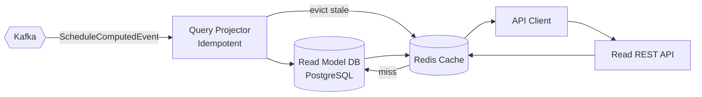

# services/query-service

## Purpose

CQRS read side. Maintains a denormalised read model built by the Query Projector consuming `ScheduleComputedEvent`. Serves low-latency read API to passenger apps and operator console with cache-aside Redis layer.

## Architecture

## Error Handling

| Scenario | Detection | Response |
|----------|-----------|---------|
| Cache miss | Redis returns nil | Fall through to DB; re-populate cache |
| Redis unavailable | `RedisConnectionException` | Degrade gracefully — serve from DB |
| DB unavailable | `DataAccessException` | 503 with circuit-breaker |
| Stale read | Projector lag | Documented per endpoint; clients receive `X-Data-Freshness` header |
