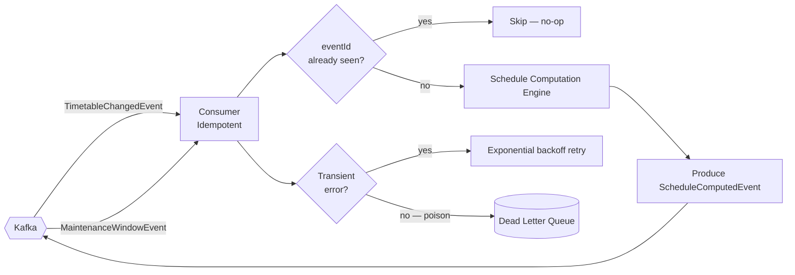

# services/schedule-service

## Purpose

Stateless computation service. Consumes `TimetableChangedEvent` and `MaintenanceWindowEvent` from Kafka, computes effective schedules (resolving conflicts, applying maintenance windows, generating stop times), and emits `ScheduleComputedEvent`.

Idempotent consumer: duplicate delivery of the same `eventId` is a no-op (deduplication via unique DB constraint on `processed_events`).

## Architecture



## Tech & Versions

| Component | Version |
|-----------|---------|
| Spring Boot | 4.0.6 |
| Spring Kafka | via Boot BOM |
| events | 1.0.0-SNAPSHOT |

## Error Handling

| Scenario | Detection | Response |
|----------|-----------|---------|
| Duplicate event | `eventId` in `processed_events` | Skip silently — idempotent |
| Transient error | Exception during computation | Retry up to 3× with exponential backoff |
| Poison message | Deserialization failure / invariant violation | Route to DLQ; alert fires |
| Kafka unavailable | Producer exception | Retry with backoff; DLQ on exhaustion |

## Testing

```bash
./mvnw verify -pl services/schedule-service -Dgroups=integration
```
