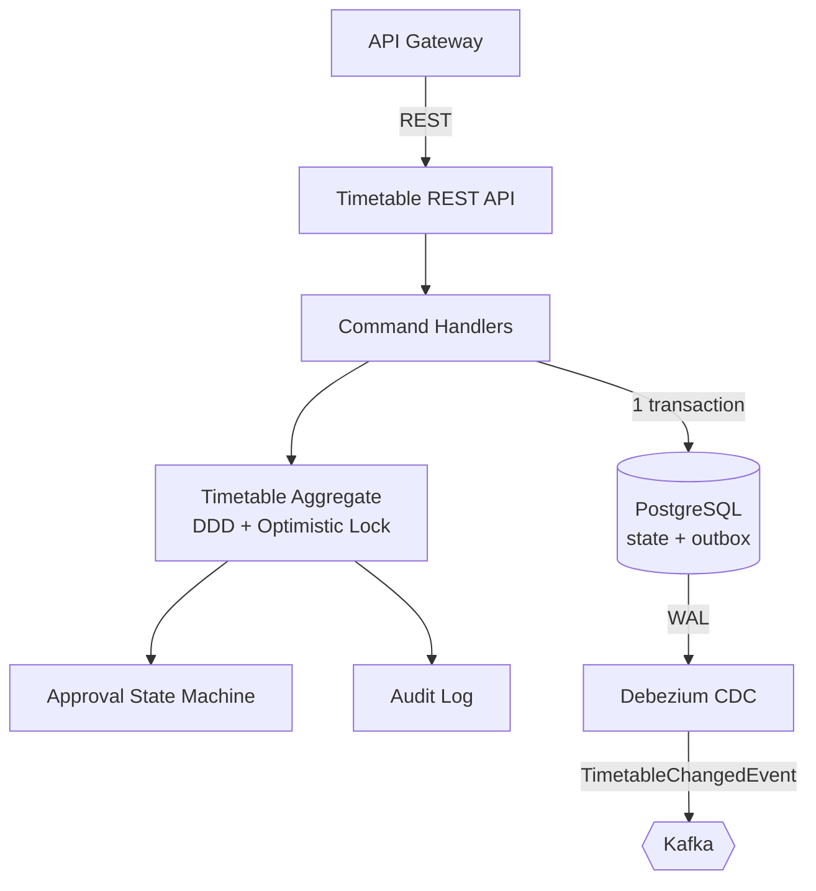
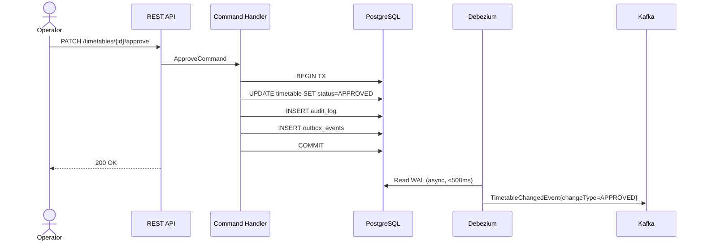

# services/timetable-service

## Purpose

The **write core** of the platform. Owns the timetable aggregate lifecycle: creation, validation, approval workflow, emergency overrides, immutable audit log, and the Transactional Outbox that guarantees every committed state change produces a corresponding Kafka event.

This service is the **only** component that writes to the timetable domain tables. All reads go through the Query Service (CQRS read side).

## Architecture





## Tech & Versions

| Component | Version |
|-----------|---------|
| Spring Boot | 4.0.6 |
| Spring Data JPA | via Boot BOM |
| PostgreSQL driver | via Boot BOM |
| Flyway | 11.9.0 |
| common-lib | 1.0.0-SNAPSHOT |
| events | 1.0.0-SNAPSHOT |

## Configuration

| Variable | Description | Source |
|----------|-------------|--------|
| `DB_URL` | PostgreSQL JDBC URL | Terraform: `rds_writer_endpoint` |
| `vault.secret.db-username` | DB username | Vault: `secret/data/railway/timetable-service` |
| `vault.secret.db-password` | DB password | Vault: `secret/data/railway/timetable-service` |
| `KAFKA_BROKERS` | Kafka bootstrap servers | Terraform: `msk_bootstrap_brokers_sasl_iam` |
| `SCHEMA_REGISTRY_URL` | Schema Registry URL | Terraform output |

## Run Locally

```bash
make up   # ensure infra is running
./mvnw spring-boot:run -pl services/timetable-service \
  -Dspring-boot.run.profiles=local
# API available at http://localhost:8081
# OpenAPI UI: http://localhost:8081/swagger-ui.html
```

## API / Events

- REST API: [OpenAPI spec](src/main/resources/openapi/timetable-api.yml)
- Events produced: `TimetableChangedEvent` → `railway.timetable.changed` (via Debezium outbox relay)
- Events consumed: none (write-only service)

## Error Handling

| Scenario | Detection | Response |
|----------|-----------|---------|
| Validation failure | Bean Validation | 422 + `ApiError` with `fieldErrors` |
| Optimistic lock conflict | `ObjectOptimisticLockingFailureException` | 409 `OPTIMISTIC_LOCK_CONFLICT` |
| Invalid state transition | `InvalidStateTransitionException` | 422 `TIMETABLE_INVALID_STATE_TRANSITION` |
| Self-approval attempt | Domain invariant check | 422 `TIMETABLE_SELF_APPROVAL_NOT_ALLOWED` |
| Emergency without justification | Domain invariant check | 422 `EMERGENCY_JUSTIFICATION_REQUIRED` |
| DB unavailable | Transaction rollback | 503 (outbox row also rolls back — no phantom event) |
| Debezium lag | Monitoring alert | No data loss; Debezium resumes from WAL position |

## Observability

- **Metrics**: RED metrics per endpoint; `timetable.approvals.total`, `timetable.state.transitions` counters; HikariCP pool.
- **Logs**: Structured JSON; every line includes `correlationId`, `timetableId`, `actor`.
- **Traces**: OTel spans for each command and DB transaction.

## Testing

```bash
./mvnw test -pl services/timetable-service -Dgroups=unit
./mvnw verify -pl services/timetable-service -Dgroups=integration
./mvnw verify -pl services/timetable-service -Dgroups=contract
```
