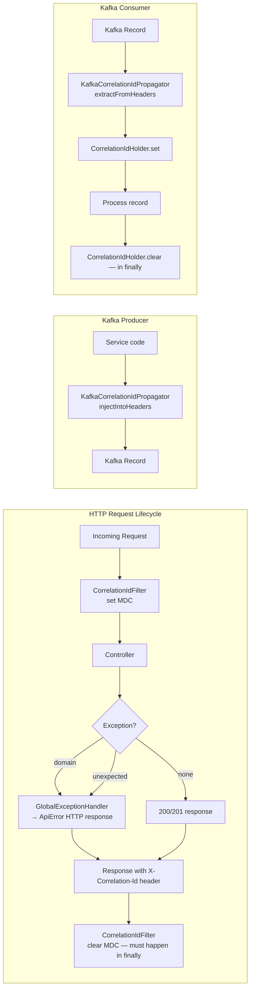

# shared/common-lib

## Purpose

Foundation library depended on by every service in the platform. Provides:
- **Standard error model** (`ApiError`, `ErrorCodes`) — uniform JSON error responses across all APIs.
- **Correlation ID propagation** — HTTP filter + Kafka header utilities + MDC management.
- **Structured logging config** — Logback JSON (Logstash encoder) for Loki ingestion.
- **Base exceptions** — typed domain exceptions that map to specific HTTP status codes.
- **Global exception handler** — translates all exceptions to `ApiError` without leaking stack traces.

## Architecture



## Tech & Versions

| Dependency | Version |
|-----------|---------|
| Spring Boot | 4.0.6 |
| logstash-logback-encoder | 8.0 |
| Spring Kafka (header utilities) | via Boot BOM |

## Correlation ID Propagation Chain

```
Browser request
  → X-Correlation-Id: <uuid>               (or absent; gateway mints one)
    → CorrelationIdFilter                   (sets MDC: correlationId=<uuid>)
      → Every log.info/warn/error call      (includes "correlationId":"<uuid>")
        → KafkaCorrelationIdPropagator      (copies MDC to Kafka header)
          → Consumer calls extractFromHeaders
            → CorrelationIdHolder.set(<uuid>)
              → Consumer log lines          (same correlationId as producer)
                → CorrelationIdHolder.clear()  (finally block — no thread leak)
    → Response X-Correlation-Id: <uuid>     (returned to browser)
```

OpenTelemetry trace context propagates in parallel via W3C `traceparent` header and is handled by the OTel Java agent (no manual code required).

## Configuration

| Property | Default | Notes |
|----------|---------|-------|
| `spring.application.name` | `railway-service` | Sets the `service` field in JSON logs |
| Active Spring profile | `default` | `local`/`default` → human-readable; `staging`/`production` → JSON |

No secrets or environment-specific values. This library has no external dependencies at runtime beyond Spring and Logback.

## Run Locally

common-lib is a dependency, not a runnable service. To build:

```bash
./mvnw clean install -pl shared/common-lib
```

## API / Events

This library exposes no HTTP API and produces no Kafka events.

## Error Handling

| Scenario | Detection | Response |
|----------|-----------|---------|
| Bean Validation failure | `MethodArgumentNotValidException` | 422 + `ApiError` with `fieldErrors` |
| `ConstraintViolationException` | Method-level validation | 422 + `ApiError` with `fieldErrors` |
| Domain exception | Any `DomainException` subclass | HTTP status from `getHttpStatus()` + `ApiError` |
| Unexpected exception | All others | 500 + `ApiError` (no stack trace in body) |
| Missing correlation ID | Header absent | New UUID minted by `CorrelationIdFilter` |
| Kafka header absent | Consumer receives record | New UUID minted by `KafkaCorrelationIdPropagator` |

## Observability

- **Logs**: All log lines include `correlationId` in MDC. JSON format in non-local profiles.
- **Metrics**: None emitted by this library. Services wire Micrometer separately.
- **Traces**: OTel agent instruments Spring automatically; no code in this library.

## Testing

```bash
./mvnw test -pl shared/common-lib -Dgroups=unit
```

Unit tests cover `ApiError`, `CorrelationIdHolder`, and `GlobalExceptionHandler`.
