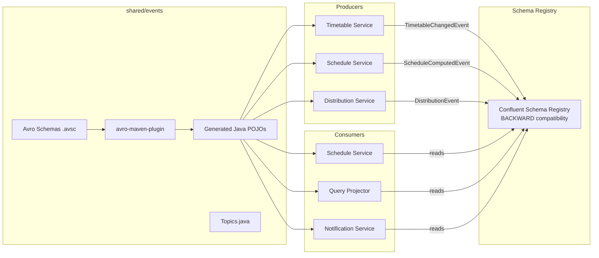

# shared/events

## Purpose

Defines the **event contracts** for the entire platform. Contains:
- **Avro schemas** (`.avsc` files) for all Kafka events — the authoritative contract between producers and consumers.
- **Generated Java POJOs** — built from schemas during `generate-sources` phase.
- **`Topics` constants** — canonical topic names; prevents typo-driven misrouting.

All schema evolution must follow the **BACKWARD compatibility rule** (see ADR-004): new fields require a default value; fields are never removed.

## Architecture



## Events

| Avro Schema | Kafka Topic | Producer | Consumers |
|------------|-------------|----------|----------|
| `TimetableChangedEvent` | `railway.timetable.changed` | Debezium (outbox relay) | Schedule Service, Query Projector |
| `ScheduleComputedEvent` | `railway.schedule.computed` | Schedule Service | Query Projector, Distribution Service, Notification Service |
| `DistributionEvent` | `railway.distribution.events` | Distribution Service | (saga tracking) |
| `NotificationRequestEvent` | `railway.notification.requests` | Distribution Service | Notification Service |
| `MaintenanceWindowEvent` | `railway.maintenance.windows` | Timetable Service | Schedule Service, Distribution Service |

## Schema Evolution Rules (ADR-004)

1. **New fields must have a `default` value** — consumers running the old schema can skip them.
2. **Never remove a field** — mark deprecated in `doc`; remove only after a planned migration.
3. **Never change a field's type** in an incompatible way.
4. **CI enforces compatibility** by running a schema compatibility check against the Schema Registry before any deployment.

## Tech & Versions

| Component | Version |
|-----------|---------|
| Apache Avro | 1.12.0 |
| avro-maven-plugin | 1.12.0 |
| kafka-avro-serializer | 7.9.1 (Confluent) |

## Run Locally — Regenerate POJOs

```bash
./mvnw generate-sources -pl shared/events
# Generated classes appear in shared/events/target/generated-sources/avro/
```

## Testing

Schema compilation is tested implicitly by `mvn generate-sources`. Integration tests for schema compatibility run in CI against the Schema Registry container.
